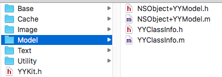
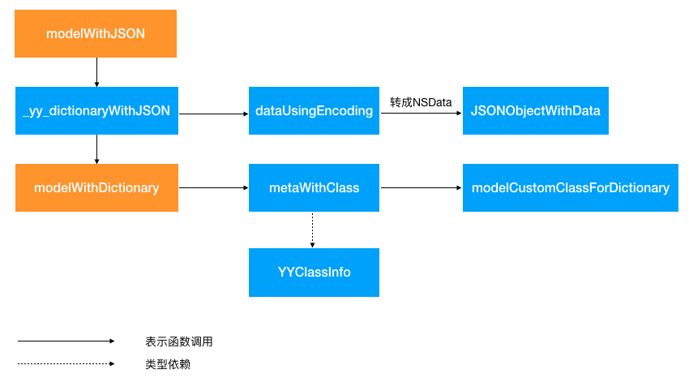
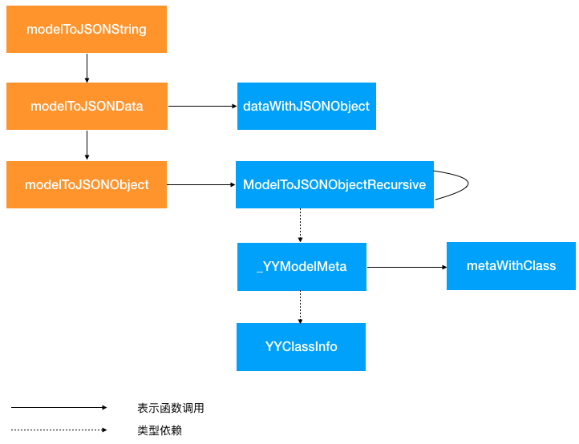
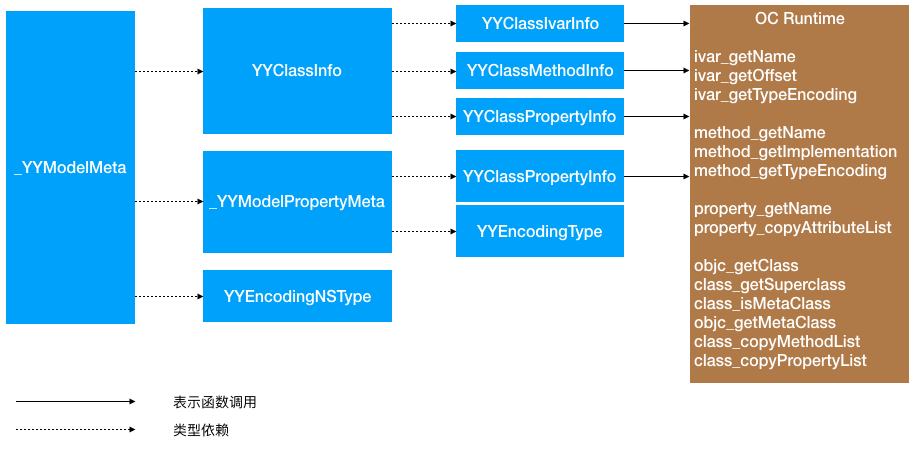
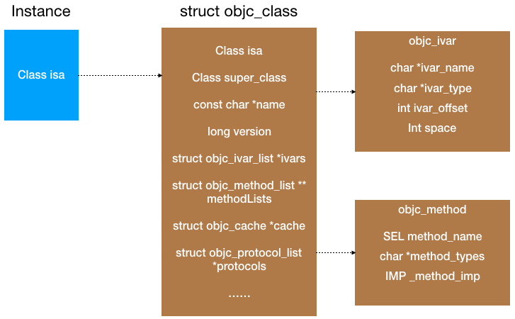

YYModel是一个高性能的 iOS JSON 模型框架，如果让我设计类似的框架，我能考虑到的几个关键点或者需要解决的问题有这几个：
- 怎么实现JSON/Dictionary与Model的互相转换
- 怎么保证类型安全
- 如何做到对Model代码无侵入
- Model嵌套如何支持
- 如何设计性能测试benchmark
- 性能方面的坑点

<!-- more -->

目前我能想到的问题只有这几个，当然实际编码时一定有更多细节。带着这些问题，可以开始看一发源码了。

## 代码结构
首先看一下代码结构，只有4个文件，代码量相对比较小。简单看一下源码，接口应该是在NSObject+YYModel里面定义和实现的，头文件中有大量的注释，包括接口的使用姿势、每个方法的详细解释，这点非常值得学习，YYClassInfo里面大量使用oc的runtime，获取class的method，SEL和IMP



因为iOS基础比较薄弱，我先把源码中使用到的语言特性和知识点粗略地列出来，以备查阅：
- KVC
- Coding/Copying/hash/equal
- Category
- oc runtime

## 怎么实现JSON/Dictionary与Model的互相转换
### 代码流程
#### JSON/Dictionary转成Model

先看一下JSON/Dictionary怎么转成Model的，大概的流程如下图，橙色方框是对外部的接口。从流程图中可以看出来JSON是先转成Dictionary，然后复用modelWithDictionary的逻辑。



#### Model转成JSON/Dictionary

Model转成JSON/Dictionary的大体流程如下图，外部接口有三个，最后都是复用modelToJSONObject的逻辑。



大体流程理清了，现在开始看详细的实现细节。主要的转换逻辑在NSObject+YYModel里面，这个类有接近2000行代码，简单地总结一下，主要包括几点：
- 数据结构定义
- 类型定义与转换
- 转换逻辑

### 数据结构定义

YYModel的数据结构定义和依赖如下图：



#### _YYModelMeta
_YYModelMeta是核心的数据结构，它主要记录了Model对象的相关信息，比如类信息(类名、方法列表、属性列表)、属性列表、key和key path的映射表等，依赖了YYClassInfo、_YYModelPropertyMeta、YYEncodingNSType等数据结构，代码段如下：

```objective-c
/// A class info in object model.
@interface _YYModelMeta : NSObject {
    @package
    YYClassInfo *_classInfo;
    /// Key:mapped key and key path, Value:_YYModelPropertyMeta.
    NSDictionary *_mapper;
    /// Array<_YYModelPropertyMeta>, all property meta of this model.
    NSArray *_allPropertyMetas;
    /// Array<_YYModelPropertyMeta>, property meta which is mapped to a key path.
    NSArray *_keyPathPropertyMetas;
    /// Array<_YYModelPropertyMeta>, property meta which is mapped to multi keys.
    NSArray *_multiKeysPropertyMetas;
    /// The number of mapped key (and key path), same to _mapper.count.
    NSUInteger _keyMappedCount;
    /// Model class type.
    YYEncodingNSType _nsType;
    
    BOOL _hasCustomWillTransformFromDictionary;
    BOOL _hasCustomTransformFromDictionary;
    BOOL _hasCustomTransformToDictionary;
    BOOL _hasCustomClassFromDictionary;
}
@end
```
#### YYClassInfo
再看一下YYClassInfo，它主要用来表示model class的基本信息：model类对象、父类对象、类名、属性列表、方法列表等等，定义了对应的子类型：YYClassIvarInfo，YYClassMethodInfo和YYClassPropertyInfo，作者使用oc runtime的接口来初始化YYClassInfo里面的各个属性，如上图橙色部分所示。

```objective-c
@interface YYClassInfo : NSObject
@property (nonatomic, assign, readonly) Class cls; ///< class object
@property (nullable, nonatomic, assign, readonly) Class superCls; ///< super class object
@property (nullable, nonatomic, assign, readonly) Class metaCls;  ///< class's meta class object
@property (nonatomic, readonly) BOOL isMeta; ///< whether this class is meta class
@property (nonatomic, strong, readonly) NSString *name; ///< class name
@property (nullable, nonatomic, strong, readonly) YYClassInfo *superClassInfo; ///< super class's class info
@property (nullable, nonatomic, strong, readonly) NSDictionary<NSString *, YYClassIvarInfo *> *ivarInfos; ///< ivars
@property (nullable, nonatomic, strong, readonly) NSDictionary<NSString *, YYClassMethodInfo *> *methodInfos; ///< methods
@property (nullable, nonatomic, strong, readonly) NSDictionary<NSString *, YYClassPropertyInfo *> *propertyInfos; ///< properties
...
@end
```

YYClassInfo实例化的过程，可以理解成对上述属性赋值的过程，可以大概分为以下几类：
- class基础信息
- ivars列表
- methods列表
- properties列表

class基础信息主要是描述继承关系的，比如父类信息、meta class，使用了runtime的接口获取到对应的属性值
```objective-c
- (instancetype)initWithClass:(Class)cls {
    if (!cls) return nil;
    self = [super init];
    _cls = cls;
    _superCls = class_getSuperclass(cls);
    _isMeta = class_isMetaClass(cls);
    if (!_isMeta) {
        _metaCls = objc_getMetaClass(class_getName(cls));
    }
    _name = NSStringFromClass(cls);
    [self _update];

    _superClassInfo = [self.class classInfoWithClass:_superCls];
    return self;
}
```
_update方法里面包含了ivars列表、methods列表、properties列表的初始化，分别使用了class_copyIvarList,class_copyMethodList,class_copyPropertyList获取到了当前类的ivars，方法和属性，这里代码比较多，就不贴出来了。这块主要的知识点是runtime，作者定义的描述class的几个数据结构基本与runtime的结构对应，可以理解成对runtime class的封装。



YYClassInfo实例化过程也有很多值得学习的地方，涉及了线程安全和实例缓存相关知识，代码片段如下，总结一下主要流程：
- 创建单例的类缓存和元类缓存
- 创建dispatch_semaphore_t锁，保证缓存线程安全
- 如果查找到缓存对象，则判断缓存对象是否需要更新并执行相关操作
- 如果没找到缓存对象，则创建并初始化YYClassInfo，并写入缓存

```objective-c
+ (instancetype)classInfoWithClass:(Class)cls {
    if (!cls) return nil;
    static CFMutableDictionaryRef classCache;
    static CFMutableDictionaryRef metaCache;
    static dispatch_once_t onceToken;
    static dispatch_semaphore_t lock;
    dispatch_once(&onceToken, ^{
        classCache = CFDictionaryCreateMutable(CFAllocatorGetDefault(), 0, &kCFTypeDictionaryKeyCallBacks, &kCFTypeDictionaryValueCallBacks);
        metaCache = CFDictionaryCreateMutable(CFAllocatorGetDefault(), 0, &kCFTypeDictionaryKeyCallBacks, &kCFTypeDictionaryValueCallBacks);
        lock = dispatch_semaphore_create(1);
    });
    dispatch_semaphore_wait(lock, DISPATCH_TIME_FOREVER);
    YYClassInfo *info = CFDictionaryGetValue(class_isMetaClass(cls) ? metaCache : classCache, (__bridge const void *)(cls));
    if (info && info->_needUpdate) {
        [info _update];
    }
    dispatch_semaphore_signal(lock);
    if (!info) {
        info = [[YYClassInfo alloc] initWithClass:cls];
        if (info) {
            dispatch_semaphore_wait(lock, DISPATCH_TIME_FOREVER);
            CFDictionarySetValue(info.isMeta ? metaCache : classCache, (__bridge const void *)(cls), (__bridge const void *)(info));
            dispatch_semaphore_signal(lock);
        }
    }
    return info;
}
```
使用缓存可以保证不用每次都创建YYClassInfo对象，提高性能。这里有两个知识点需要mark一下：
- 使用信号量保证线程安全
- 使用Core Foundation的CFMutableDictionaryRef来作为缓存容器。这里必须提一下Core Foundation了，记得有次面试被问Core Foundation和Foundation的关系，我当时是一脸懵逼的，就瞎说一通啦。其实可以很简单地理解为，Core Foundation是C语言版本的Foundation，功能基本与Foundation对应，前缀是CFxxx的Core Foundation里面的方法，Foundation里面的函数前缀一般是NSxxx。CoreFoundation的方法有更高的性能，所以这里使用CFMutableDictionRef而不是NSMutableDiction来实现缓存。

### 类型定义与转换

## 怎么保证类型安全

## 如何做到对Model代码无侵入

## Model嵌套如何支持

## 如何设计性能测试benchmark

## 用到了哪些我不熟悉的语言特性
1. Type Encodings 和 Declared Properties
2. ptrdiff_t
3. Dispatch Semaphore
4. CoreFoundation中的CFMutableDictionaryRef
5. Objective-C Runtime
6. @package
7. __unsafe_unretained 修饰符

## 性能相关的Tips
### 尽量用纯 C 函数、内联函数
使用纯 C 函数可以避免 ObjC 的消息发送带来的开销。如果 C 函数比较小，使用 inline 可以避免一部分压栈弹栈等函数调用的开销。NSObject+YYModel中作者定义了一个force_inline宏，很多函数都是定义成内联的。

```objective-c
#define force_inline __inline__ __attribute__((always_inline))
...
static force_inline YYEncodingNSType YYClassGetNSType(Class cls);
static force_inline NSNumber *YYNSNumberCreateFromID(__unsafe_unretained id value);
static force_inline NSDate *YYNSDateFromString(__unsafe_unretained NSString *string);
...
```

## 参考资料
1. [iOS JSON 模型转换库评测](https://blog.ibireme.com/2015/10/23/ios_model_framework_benchmark)
2. [揭秘 YYModel 的魔法（上）](https://juejin.im/post/5a097435f265da431769a49c)
3. [揭秘 YYModel 的魔法（下）](https://juejin.im/post/5a1296e36fb9a044fb075d5e)