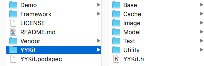

偶然翻到前同事博客的一篇文章：[阅读源码的乐趣](http://limboy.me/tech/2014/12/17/the-pleasure-of-reading-source.html)，这位老哥是iOS开发领域的网红，相信很多人都看过他的博客。文章中他通过一个栗子详细描述了自己是怎么看源码的，强调看源码对扩宽视野，提高品味，锻炼思维等等各方面的重要性，个人觉得他这篇文章还是挺有指导意义的。

<!-- more -->

## 为啥要看YYKit源码
我的项目经历和技术栈比较杂，过去的5年左右，我做过Android平台音视频相关的项目，移植过Chromium内核到Android平台，定制和维护过iOS平台的React Native框架，也做过Android和iOS平台上的H5 Hybrid容器。虽然主要技术方向是移动端的相关开发，但是对Android或iOS的应用层开发都不怎么熟悉，甚至连中级工程师的水平都达不到。基于这个考虑，我决定开始研究一些优秀的开源项目，希望能对iOS开发有更深入的理解和认识。

[YYKit](https://github.com/ibireme/YYKit)是一个非常优秀的开源项目，是一位大神在业余时间把工作中遇到的常见和通用的模块沉淀和积累出来的，里面包含了缓存、图片、Model、富文本组件、Category工具库、异步绘制和显示、并发队列等，基本涵盖了 iOS 实际项目开发中必须的基础功能组件，另外代码质量也非常高，在业界广受好评。

## 想通过源码学习什么
先看一下YYKit的源码结构，主要源码在YYKit目录下，每个模块都可以再项目中单独引用。这里先记录一下我目前能想到的每个模块我想了解的知识点。分析源码的主要路径是假定自己要设计类似的模块，我是怎么思考的，然后再对照大神的思路。

### [YYModel](https://github.com/ibireme/YYModel)
YYModel是一个高性能的 iOS JSON 模型框架，类似的框架也有很多，我想从YYModel中学习的是：
- YYModel的优势在何处？性能更好还是支持的特性更多，亦或是接口对开发者更友好
- JSON或者Dictionary与Model的互相转换是怎么实现的，怎么保证类型安全的
- 怎么设计性能测试的benchmark
- 编码风格，使用了哪些语言特性

### [YYCache](https://github.com/ibireme/YYCache)
YYCache是一个缓存框架，支持磁盘和内存级别的缓存，类似的开源框架有：TMCache,PINCache，从benchmark的测试数据来看，YYCache的性能明显优于其他框架，我想学习的是：
- LRU算法的实现细节
- 线程安全相关
- 内存管理相关，比如内存缓存对象何时被释放
- 缓存策略控制：磁盘缓存和内存缓存的使用场景
- 缓存的数据结构设计
- 如何设计性能测试的benchmark
- 编码风格，使用了哪些语言特性

### [YYImage](https://github.com/ibireme/YYImage)
YYImage是一个功能强大的图像库，支持的格式比较全面、支持动画图像(比如GIF)和帧动画，另外还支持渐进式加载。图像是每个APP都必须包含的基础组件，但也是最容易出问题的，一旦使用不当很容易导致OOM或者Crash，通过这个项目我主要想学习：
- 渐进式加载的技术原理是什么？作者是怎么实现的
- 内存管理相关的知识点
- 各种格式图像(比如WebP，TIFF等)解码是怎么实现的，是用系统接口还是第三方库
- 帧动画是怎么实现的

### [YYWebImage](https://github.com/ibireme/YYWebImage)
YYWebImage是一个异步图片加载框架，类似的框架有大名鼎鼎的SDWebImage，平时项目开发中我基本也是使用SDWebImage的。但是作者在项目介绍中说YYWebImage的设计目的是试图替代 SDWebImage、PINRemoteImage、FLAnimatedImage 等开源框架，它支持这些开源框架的大部分功能，同时增加了大量新特性、并且有不小的性能提升。YYWebImage使用YYImage和YYCache处理图像、动画显示和缓存相关逻辑，所以YYWebImage应该只包含异步图像加载的逻辑了。通过这个项目我想了解：
- 多线程相关知识点
- 异步网络IO和文件IO
- UIImageView，UIButton，CALayer相关知识点，性能坑点
- 编码风格

### [YYText](https://github.com/ibireme/YYText)
YYText是一个富文本显示组件，支持丰富的文字排版熟悉，甚至还能解析markdown，所以学会了YYText的使用姿势基本可以应对产品的各种奇葩需求了，当然复杂的数学公式除外啦。通过学习YYText我想深入了解：
- UILable和UITextView的各种知识点
- 如何优雅地封装一个UI组件，这个也是我最薄弱的技能点了
- 字符串相关的知识点：解析、AttributedString
- UI渲染性能

### [YYDispatchQueuePool](https://github.com/ibireme/YYDispatchQueuePool)
iOS 全局并发队列管理工具，主要解决concurrent queue创建大量线程导致主线程卡顿，可以解决UI卡顿的问题。iOS 并发编程这块我了解的很少，所以通过这个项目我最主要的是学习：
- concurrent编程的基础知识，比如GCD，NSOperationQueue等

### [YYAsyncLayer](https://github.com/ibireme/YYAsyncLayer)
YYAsyncLayer是异步绘制与显示的工具类，怎么优化UI相关代码逻辑，保证APP流畅是非常重要的一个主题，这个模块的代码量虽然不大，但是需要一些背景知识才能看懂，比如UI卡顿的原因是什么，有啥通过的解决思路。为了演示YYAsyncLayer的使用姿势，作者还开发了一个微博feed流的Demo，这个Demo的代码也很有参考价值，通过这个项目我主要想学习：
- UI卡顿和优化的各种思路
- 如何客观评测UI的流畅度
- Demo中实现的微博feed流代码风格，看看大神是怎么写类似的业务代码

### [YYCategories](https://github.com/ibireme/YYCategories)
YYCategories是一系列Category工具类，基本涵盖了日常开发过程中常见的工具类。这一部分的知识点可能会比较零碎，可以学习一下作者的编码风格

## 总结
简单地总结一下，因为最近意识到我对iOS应用开发层面了解不多，所以想系统地学习一下基础知识，研究源码是最高效直接方式，因此选择YYKit这个全面且优秀的开源项目开始。希望通过对YYKit各个模块源码的分析，能深入地了解iOS开发方方面面。当然优秀的开源项目还有很多很多，一步一步来吧~