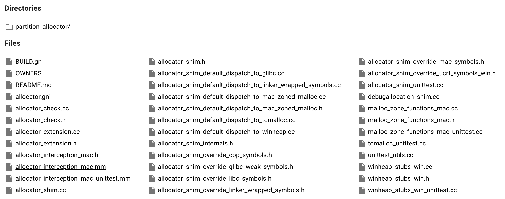
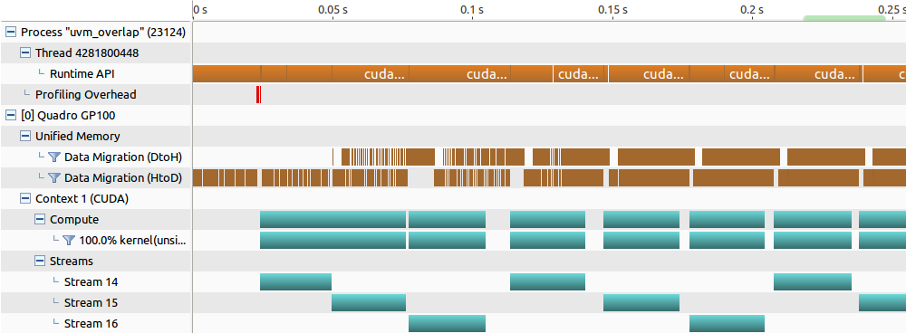
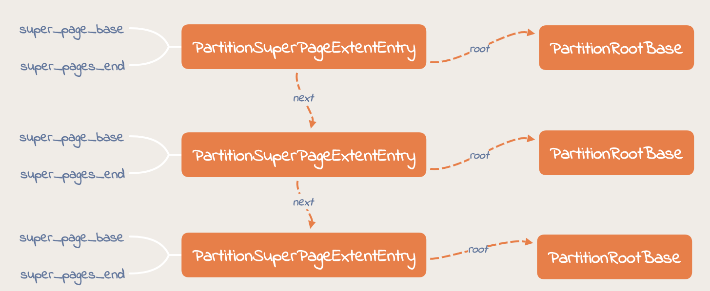
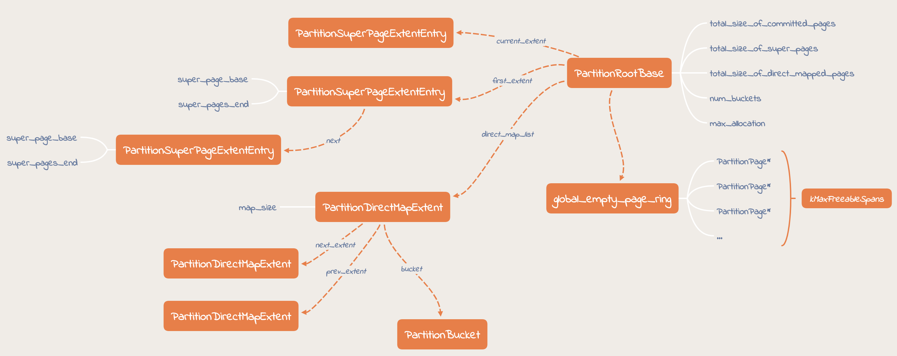
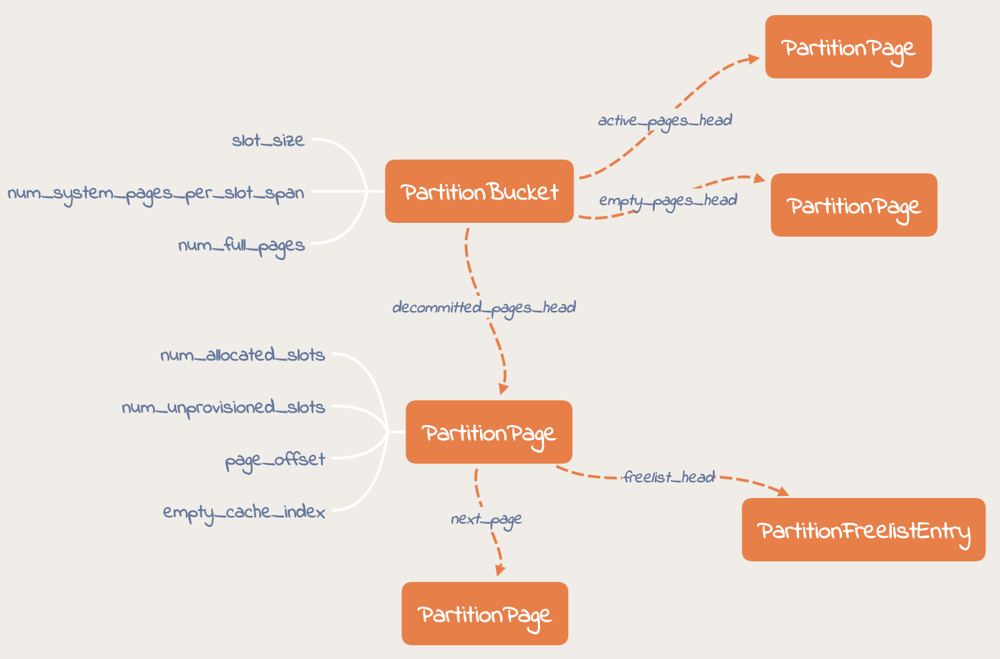
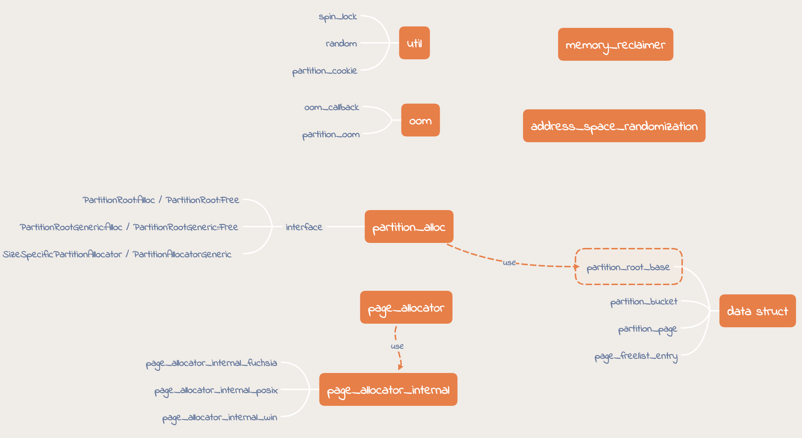

allocator 是 C++ std 中引入的，为了处理各种内存管理模式（比如共享内存、垃圾回收等）的内存分配问题，负责内存的分配、回收，对象的创建析构等。

Chromium 的 base 库中有个 allocator 的目录，这是 Chromium 中使用的 allocator，为啥需要自己定义一个 allocator，不直接用系统的呢？ 这篇文章是我看代码过程的记录和总结。先看一下代码的目录结构：

<!--more-->

## Chromium 中的 allocator

Chromium code base 中用到了多个 allocator，比如 allocator_shim, PartitionAlloc，还有 Blink 中用到的 Olipan。这篇文章主要关注 allocator_shim 和 PartitionAlloc。

### allocator_shim
allocator_shim 就是对各个平台 allocator 的封装，比如 malloc / new, 为什么要增加这一层封装呢？ 主要基于两点考虑，其一是在封装层增加很多 Security 检测逻辑，避免一些常见的安全漏洞，比如缓冲区溢出等。第二，可以 dump 更多 memery 相关的信息，方便排查内存以及性能问题等。

Chromium 有完整的 MemoryInfra 体系，包括采集 measuring data(chrome://tracing), memory dump, benchmarks (Telemetry) 和 chromeperf dashboard。这套体系的数据采集离不开自定义 allocator 的支持。

### PartitionAlloc
allocator_shim 仅仅是对系统 allocator 的封装，而 PartitionAlloc 是基于 Partitions 和 Buckets 模型实现了一个 allocator。

Partition 是一个堆，它包含特定的对象类型、特定大小的对象或特定生命周期的对象（如调用方所愿）。调用方可以根据需要创建任意多个分区。每个 Partition 包含多个Buckets。bucket 是 Partition 中包含相似大小对象的区域。

PartitionAlloc 在 Security 方面做的更好，保证每个 Partition 都是独立的，并且受到保护，不受任何其他 Partition 的影响。这样一来可以避免 buffer overflow 破坏其他 Partition 的数据。

#### PartitionAlloc 的主要接口
- PartitionRoot::Alloc() / PartitionRoot::Free()
    - Partition 操作非线程安全
    - 编译时决定需分配的内存大小(不能超过某个最大值)
    - 分配对象大小必须是系统指针大小的整数倍
- PartitionRootGeneric::Alloc() / PartitionRootGeneric::Free()
    - Partition 线程安全
    - 可以分配任意大小的内存 (不能超过 INT_MAX)
    - Bucket 大小由待分配内存决定，自动填充为系统指针 size 整数倍, 比如申请分配大小为 4000， bucket 大小则为 4096

PartitionRoot / PartitionRootGeneric 实现的功能类似于 malloc 和 free。不同的是，该对象表示一个 “堆分区”， 每个分区在一个独立的地址空间内，互不干扰。 

- SizeSpecificPartitionAllocator / PartitionAllocatorGeneric

#### PartitionAlloc 的数据结构
1. PartitionSuperPageExtentEntry

2. PartitionRootBase

3. PartitionBucket 与 PartitionPage

#### PartitionAlloc 的代码结构

## 学习到的一些知识点
- spin lock 的用法
- constexpr 关键字
- volatile 关键字
- unittest 与 perftest 的思路

## 修改历史
|修改时间|说明|
|--|--|
|2020-01-03|创建文档+初稿|
|2020-01-04|增加 PartitionAlloc 部分|