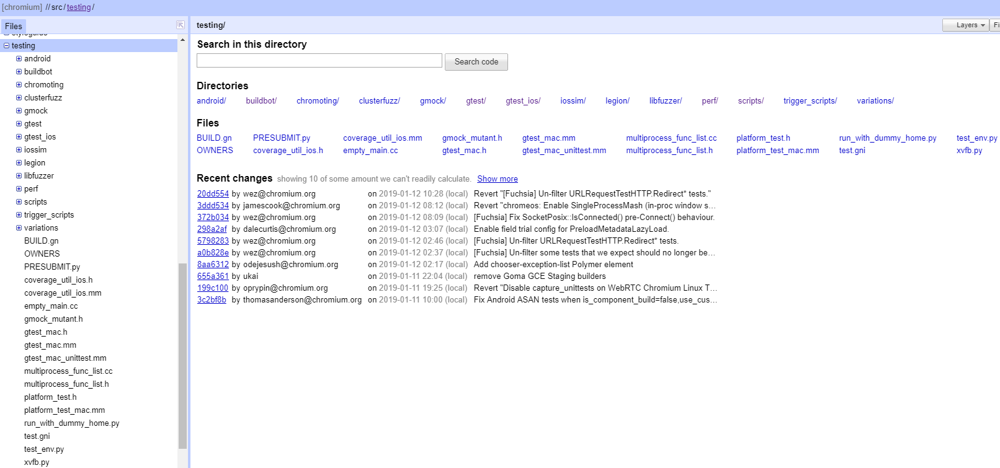
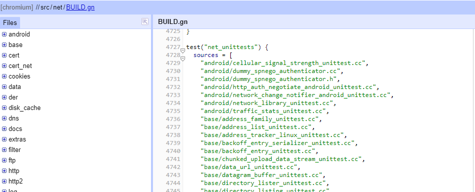
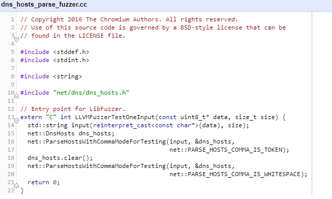
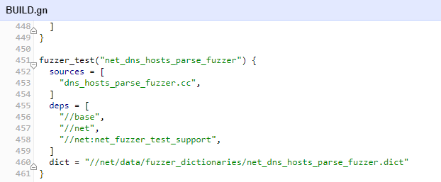
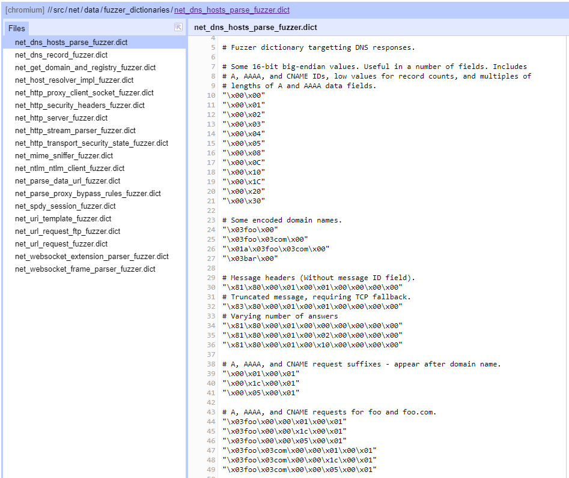
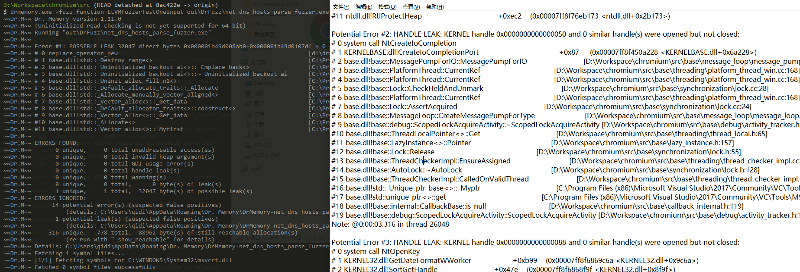

Chromium 这样庞大的工程，涉及超多的模块依赖，如何保证代码质量？源码中随处可见 xxx_unittest.cc 和 xxx_fuzzer.cc 这样的文件，它们是如何组织的呢？项目的每一个 Commit 需要执行哪些测试，流程是什么？Chromium 做了哪些基础的工作支持繁琐又重要的测试工作，我们是否可以借鉴用到自己的项目中？

<!--more-->

带着这些问题，开始阅读源码~ 先看一下 src 目录下有个 testing 的文件夹，里面存放了测试相关的基础代码和脚本:



Chromium 工程做了哪些测试呢？这里列举一下我从源码看到的，可能不全面。

## 单元测试

项目中所有模块都有大量的单元测试，命名规则为 xxx_unitest.cc, 每个模块的单元测试文件会放到一个 target 里编译, 比如下图就是 net 模块的单元测试 target。C/C++ 部分的单元测试是基于 gtest/gmock 这个框架的，可以看出来 Chromium 的 committer 花费了大量的时间保证大部分代码都是经过单元测试的。这个值得我们学习，我在 [Chromium 跨平台基础库：多线程](https://ustcqidi.github.io/2018/12/14/chromium-base-thread/#more) 中提到过，单元测试一方面保证代码质量，另一方面单元测试是很好的 code example，方便别人了解如何使用我们的代码。



## fuzz testing

以前完全没听过，所以查了一下，这是原文解释："Fuzzing, which is simply providing potentially invalid, unexpected, or random data as an input to a program, is an extremely effective way of finding bugs in large software systems, and is an important part of the software development life cycle."

大体意思是随机输入大量无效、随机数据进行测试。对于 C/C++ 工程来说，可能会测出来潜在的内存越界，栈溢出等问题。一般大型的项目都需要 fuzz testing。

Chromium 的 fuzz test 是基于 [libFuzzer](https://llvm.org/docs/LibFuzzer.html) 这个库；具体的 fuzz test 只需要 fuzz target 这个函数就行了，实际上就是一个入口函数：

``` c
// fuzz_target.cc
extern "C" int LLVMFuzzerTestOneInput(const uint8_t *Data, size_t Size) {
  DoSomethingInterestingWithMyAPI(Data, Size);
  return 0;  // Non-zero return values are reserved for future use.
}
```

Chromium 的 fuzz test 文件命名规则为 xxx_fuzzer.cc, 因为只需要在 fuzz target 中把随机数据输入到待测试的接口中就行了，所以代码比单元测试少的多，下图是 dns_hosts_parse 的 fuzz testing



### Dr.Memory / Dr.Fuzz

Dr.Fuzz 是 Dr.Memory 的一部分，Chromium 中的所有 fuzz testing 都是用 Dr.Fuzz 运行起来的；[Dr.Memory](http://drmemory.org/) 是一个内存分析工具，主要用于检测内存相关的错误，比如：
- 读取未初始化内存
- 访问无效内存区域（比如：buffer overflow/underflow, user-after-free）
- 多次释放内存，内存泄漏
- handle 泄漏等

无论我们自己的项目中是否有 fuzz testing, Dr.Memory 这个工具是非常有用的。

### fuzz testing 管理

与单元测试类似，Chromium 中所有的 fuzz testing 文件都对应一个编译 target



每次 fuzz test 都会从 net_dns_hosts_parse_fuzzer.dict 中选一个作为 data



### fuzz testing 编译、运行
1. 编译
- mkdir -p out/DrFuzz
- gn gen out/DrFuzz --args=use_drfuzz=true
- ninja -C out\DrFuzz net_dns_hosts_parse_fuzzer

2. 运行
- bin/drmemory -fuzz_function LLVMFuzzerTestOneInput out/DrFuzz/net_dns_hosts_parse_fuzzer

