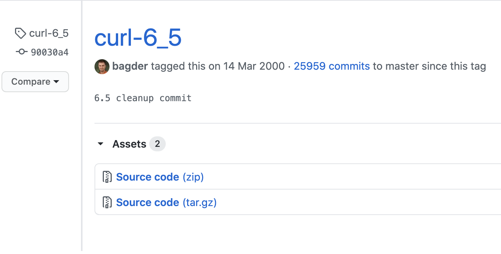
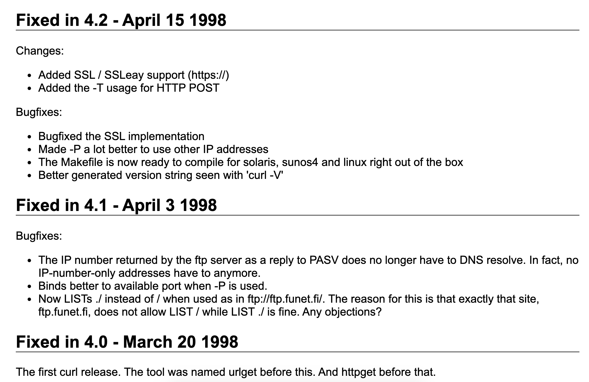

晚上在浏览 curl github 上的 tag, 好奇心驱使。我翻到了 curl 的第一个 release tag: curl-6_5

<!--more-->

tag 的创建日期是 2000年5月14日，至今已经20余年了，当时我才读小学，有种穿越时空的奇妙感觉。

一直想学习一些 curl 的源码，可惜最新版本的代码量太大了，数据结构和调用关系错综复杂无从入手。第一版本应该是只支持了最基础的功能，果断下载。

相比之下，代码量少了很多。结构也简单明了不少。

对照着官方的release note，以及commit id，学习大佬怎么一步一步把 curl 做成今天的样子，真有挖到宝藏的感觉。

这是官方 doc. 里最早的几个版本的 release note

## 附录

### RESOURCES 文件记录了一些 RFC 文档

- RFC 959  - Defines how FTP works
- RFC 1738 - Uniform Resource Locators
- RFC 1777 - defines the LDAP protocol
- RFC 1808 - Relative Uniform Resource Locators
- RFC 1867 - Form-based File Upload in HTML

- RFC 1950 - ZLIB Compressed Data Format Specification
- RFC 1951 - DEFLATE Compressed Data Format Specification
- RFC 1952 - gzip compression format

- RFC 1959 - LDAP URL syntax
- RFC 2045-2049 - Everything you need to know about MIME! (needed for form based upload)
- RFC 2068 - HTTP 1.1 (obsoleted by RFC 2616)
- RFC 2109 - HTTP State Management Mechanism (cookie stuff)
- Netscape's specification at http://www.netscape.com/newsref/std/cookie_spec.html
- RFC 2183 - "The Content-Disposition Header Field"
- RFC 2229 - "A Dictionary Server Protocol"
- RFC 2231 - "MIME Parameter Value and Encoded Word Extensions: Character Sets, Languages, and Continuations"
- RFC 2388 - "Returning Values from Forms: multipart/form-data" Use this as an addition to the 1867 
- RFC 2396 - "Uniform Resource Identifiers: Generic Syntax and Semantics" 
- RFC 2428 - "FTP Extensions for IPv6 and NATs"
- RFC 2616 - HTTP 1.1
- RFC 2617 - HTTP Authentication

### FEATURES 文件记录了支持的 feature

1. Misc
    - full URL syntax
    - custom maximum download time
    - custom least download speed acceptable
    - multiple URLs
    - guesses protocol from host name unless specified
    - uses .netrc
    - progress bar/time specs while downloading
    - PROXY environment variables support
    - config file support
    - compiles on win32

1. HTTP
    - GET
    - PUT
    - HEAD
    - POST
    - multipart POST
    - authentication
    - resume
    - follow redirects
    - custom HTTP request
    - cookie get/send
    - custom headers (that can replace internally generated headers)
    - custom user-agent string
    - custom referer string
    - range
    - proxy authentication
    - time conditions
    - via http-proxy

1. HTTPS (*1)
    - (all the HTTP features)
    - using certificates
    - via http-proxy

1. FTP
    - download
    - authentication
    - PORT or PASV
    - single file size information (compare to HTTP HEAD)
    - 'type=' URL support
    - dir listing
    - dir listing names-only
    - upload
    - upload append
    - upload via http-proxy as HTTP PUT
    - download resume
    - upload resume
    - QUOT commands (before and/or after the transfer)
    - simple "range" support
    - via http-proxy

1. TELNET
    - connection negotiation
    - stdin/stdout I/O

1. LDAP (*2)
    - full LDAP URL support

1. DICT
    - extended DICT URL support

1. GOPHER
    - GET
    - via http-proxy

1. FILE
    - URL support

        *1 = requires OpenSSL
        *2 = requires OpenLDAP