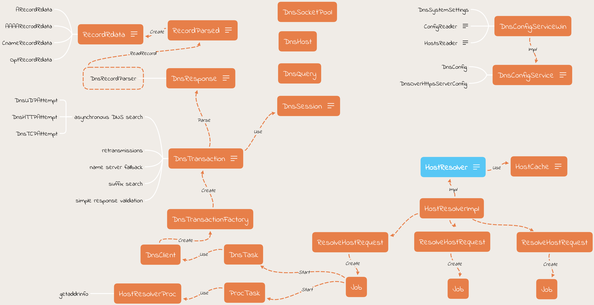
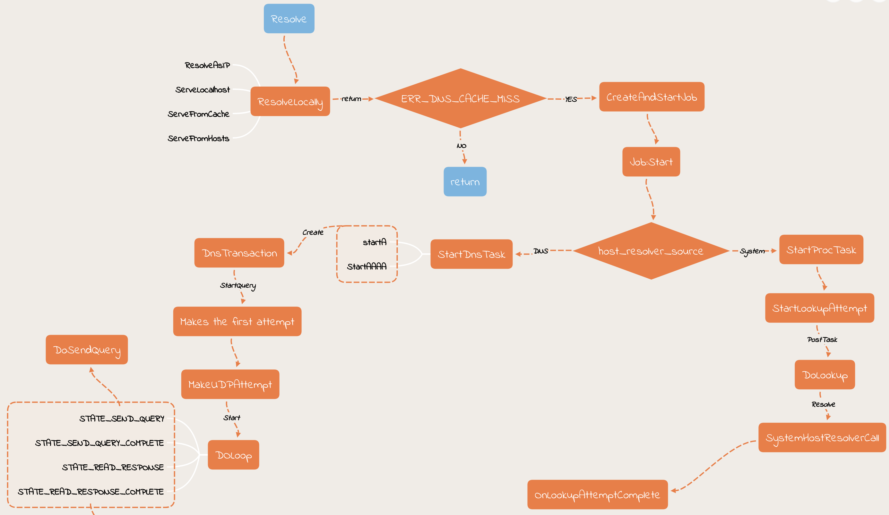

阅读源代码是程序员最重要的基本功之一，研读高质量的开源项目源码是进阶的必要手段。那么面对一个新项目时，如何高效快速地熟悉整个源码呢？

<!--more-->

## 我是怎么阅读源码的
根据阅读源码的仔细程度，主要分为三个阶段/粒度：Module Level，Class Level，Detail Level

### Module Level
浏览整个源码的目录结构，了解一下大体包含了哪些内容，搞清楚代码的大体组织结构，对项目整体有个感性的认识。

### Class Level
针对某个特定模块，搞清楚每个源文件/类的大体作用，搞清楚主要的接口有哪些、类之间的调用/依赖关系等；此外还需要对该模块的主要功能流程有直观的认识。通常这个时候我会画一些思维导图/流程图帮助理解。

比如, 下面这两张图是我看 Chromium 网络库中 DNS 解析相关的代码时画的。第一张图帮助理清该模块有哪些源文件以及他们之间的关系。

下面这张图是具体的功能流程图，帮助理解整体的流程。

### Detail Level
经过前面两个阶段，对源码有了宏观上的认识，Detail Level 是根据具体需求，更加细粒度地研读代码，比如研究某个函数的实现细节，优化思路等等

## 大家的观点
知乎，HackNews 上有很多讨论此类话题的帖子：
- [如何去阅读并学习一些优秀的开源框架的源码？](https://www.zhihu.com/question/26766601)
- [How do you familiarize yourself with a new codebase?](https://news.ycombinator.com/item?id=9784008)
- [Strategies to quickly become productive in an unfamiliar codebase](https://news.ycombinator.com/item?id=8263402)

总结一下高赞回答的观点:

### 通读一遍官方文档和 demo

### 带着问题去读
读代码通常要能回答两个问题：要解决什么问题？如何实现的？大到整个项目，小到一个模块，函数，看的时候，都要抱着这两个问题去看。看完了，这两个问题能答上来，才是有效

### 边读边干
尽可能编译调试。能调试的代码，几乎没有看不懂的

### 层次分明
横向分层，纵向分块。代码都是分模块的，有的是 core, 有的是 util，parser 之类的，要知道看的是哪一层，那一块

### Deep Dive
I start with a relatively high level interface point, such as an important function in a public API. Such functions and methods tend to accomplish easily understandable things. And by "important" I mean something that is fundamental to what the system accomplishes.

Then you dive.

Your goal is to have a decent understanding of how this fundamental thing is accomplished. You start at the public facing function, then find the actual implementation of that function, and start reading code. If things make sense, you keep going. If you can't make sense of it, then you will probably need to start diving into related APIs and - most importantly - data structures.

This process will tend to have a point where you have dozens of files open, which have non-trivial relationships with each other, and they are a variety of interfaces and data structures. That's okay. You're just trying to get a feel for all of it; you're not necessarily going for total, complete understanding.

What you're going for is that Aha! moment where you can feel confident in saying, "Oh, that's how it's done." This will tend to happen once you find those fundamental data structures, and have finally pieced together some understanding of how they all fit together. Once you've had the Aha! moment, you can start to trace the results back out, to make sure that is how the thing is accomplished, or what is returned. I do this with all large codebases I encounter that I want to understand. It's quite fun to do this with the Linux source code.

My philosophy is that "It's all just code", which means that with enough patience, it's all understandable. Sometimes a good strategy is to just start diving into it.

## 工具
工具顺手，事半功倍，借助工具帮我们阅读并理解源码至关重要。

### IDE
一般的中小型项目，选择一个用的顺手就行。我个人喜欢用 VS Code 和 Source Insigth。但是如果是代码量很大的项目，比如 Chromium，Linux 等，动辄就几千万行代码，一般的 IDE 是扛不住的。我曾经尝试用 VS Code 和 Visual Studio 读完整版的 Chromium 源码，结果查找一个符号的 reference 就卡到崩溃。最终我只好打开部分模块，这样基本是可以解决刚才所说的问题，但是前提是你要读的这部分代码相对比较独立；如果依赖很多模块的话，那么可能要丢失一些依赖或引用信息了。 所幸的是，Google 推出了一个在线阅读 Chromium 源码的方案： https://cs.chromium.org/ ，在这个也可以快速方便地阅读完整版 Chromium 源码，更棒的是，可以非常快速地查找引用，调用关系，修改历史，declarations, definition 和 class 的 outline 等等。 其他大型的项目一般也是有在线阅读的方案，如果是在没有，可以自己搭建一个这样的服务；Google 开源了一个 Code Search 的工具，具体细节可以在[这里](https://github.com/google/codesearch)

### 流程图
我个人喜欢用 XMind 和 https://www.websequencediagrams.com/