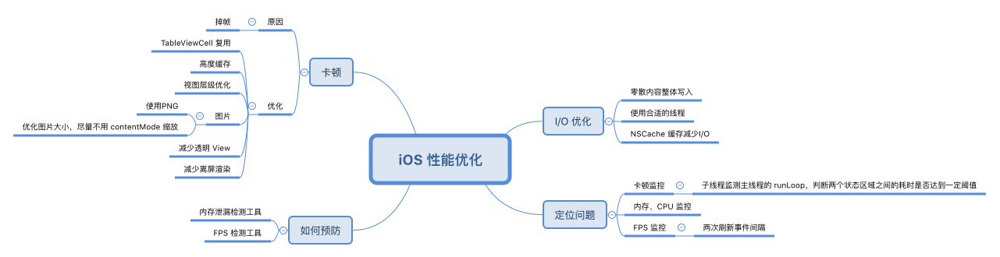
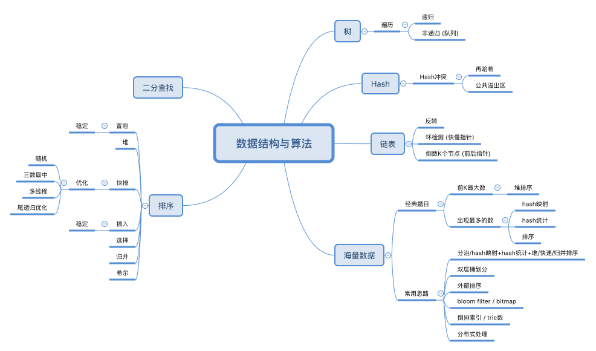
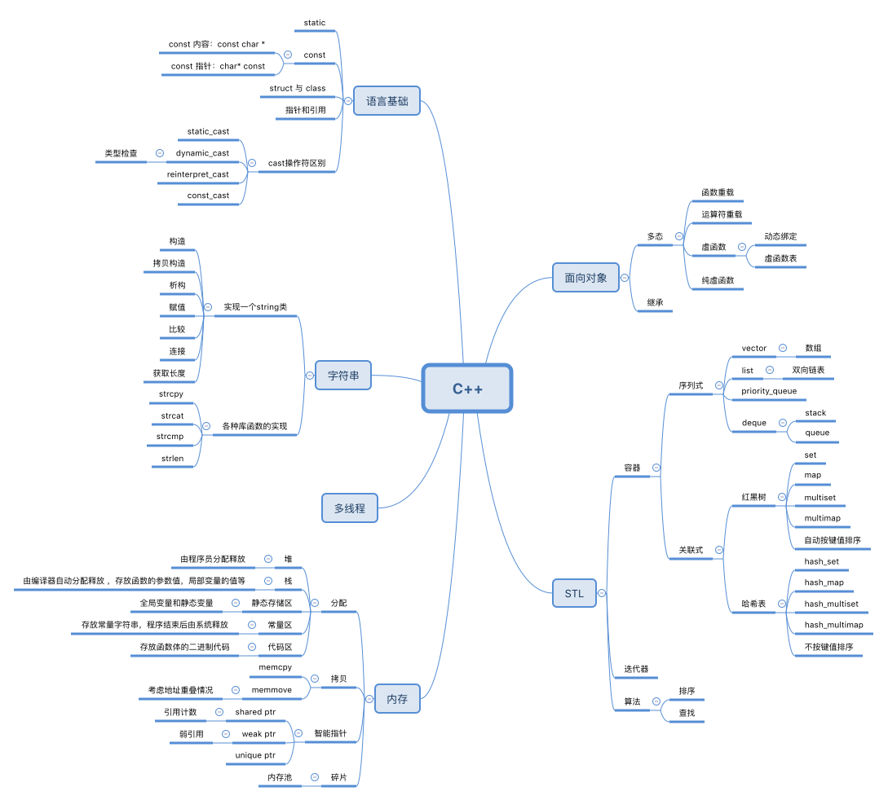
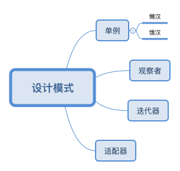
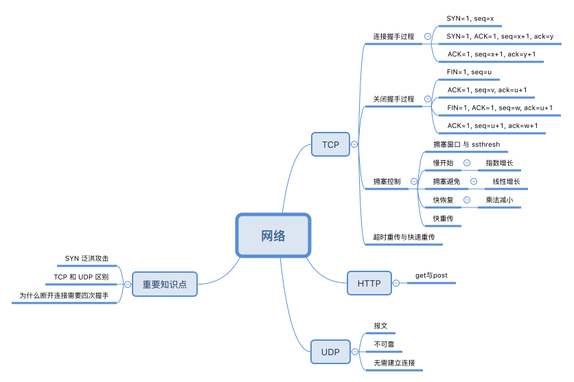
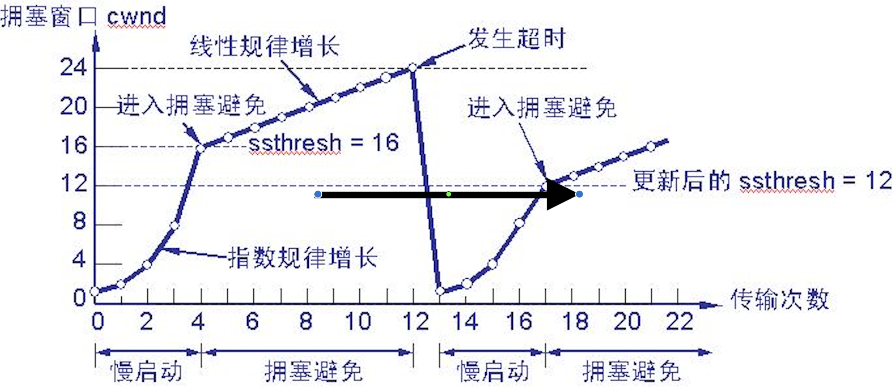
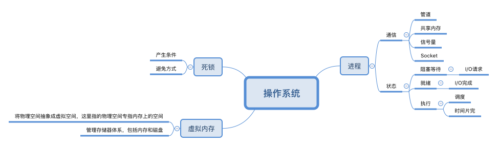

# iOS
## 性能优化



## block
### 什么时候在 block 里面用 self, 不需要使用 weak self
我们知道, 在使用 block 的时候, 为了避免产生循环引用, 通常需要使用 weakSelf 与 strongSelf, 写下面这样的代码：
```objective-c
__weak typeof(self) weakSelf = self;
[self doSomeBlockJob:^{
    __strong typeof(weakSelf) strongSelf = weakSelf;
    if (strongSelf) {
        ...
    }
}];
```
那么请问: 什么时候在 block 里面用 self, 不需要使用 weak self ?

<!--more-->

当 block 本身不被 self 持有, 而被别的对象持有, 同时不产生循环引用的时候, 就不需要使用 weak self 了. 最常见的代码就是 UIView 的动画代码, 我们在使用 UIView 的 animateWithDuration:animations 方法 做动画的时候, 并不需要使用 weak self, 因为引用持有关系是:

- UIView 的某个负责动画的对象持有了 block
- block 持有了 self

因为 self 并不持有 block, 所以就没有循环引用产生, 因为就不需要使用 weak self 了

```objective-c
[UIView animateWithDuration:0.2 animations:^{
    self.alpha = 1;
}];
```

当动画结束时, UIView 会结束持有这个 block, 如果没有别的对象持有 block 的话, block 对象就会释放掉, 从而 block 会释放掉对于 self 的持有. 整个内存引用关系被解除.

### 为什么 block 里面还需要写一个 strongSelf, 如果不写会怎么样?
在 block 中先写一个 strongSelf 其实是为了避免 block 的执行过程中, 突然出现 self 被释放的尴尬情况. 通常情况下, 如果不这么做的话, 还是很容易出现一些奇怪的逻辑, 甚至闪退.

以 AFNetworking 中 AFNetworkReachabilityManager.m 的一段代码举例:

```objective-c
__weak __typeof(self)weakSelf = self;
AFNetworkReachabilityStatusBlock callback = ^(AFNetworkReachabilityStatus status) {
    __strong __typeof(weakSelf)strongSelf = weakSelf;

    strongSelf.networkReachabilityStatus = status;
    if (strongSelf.networkReachabilityStatusBlock) {
        strongSelf.networkReachabilityStatusBlock(status);
    }

};
```

如果没有 strongSelf 的那行代码, 那么后面的每一行代码执行时, self 都可能被释放掉了, 这样很可能造成逻辑异常.

特别是当我们正在执行 strongSelf.networkReachabilityStatusBlock(status); 这个 block 闭包时, 如果这个 block 执行到一半时 self 释放, 那么多半情况下会 Crash.

# 跨平台

# 数据结构与算法
<br>

## 排序
C++ 手写冒泡、选择、插入、希尔、归并、堆、快排， 参考资料: [七种常见经典排序算法总结（C++实现）](http://yansu.org/2015/09/07/sort-algorithms.html)

## 二分搜索
C++ 手写二分搜索，参考资料: [二分搜索算法](https://zh.wikipedia.org/wiki/%E4%BA%8C%E5%88%86%E6%90%9C%E7%B4%A2%E7%AE%97%E6%B3%95)

## 海量数据
经典思路:
- 分而治之/hash映射 + hash统计 + 堆/快速/归并排序
- 双层桶划分
- Bloom filter/Bitmap
- Trie树/数据库/倒排索引
- 外排序
- 分布式处理之Hadoop/Mapreduce

参考资料: [教你如何迅速秒杀掉：99%的海量数据处理面试题](https://blog.csdn.net/v_july_v/article/details/7382693)

# C++
<br>

## 语法基础
### new、delete、malloc、free
- delete会调用对象的析构函数,和new对应free只会释放内存，new调用构造函数
- malloc与free是C++/C语言的标准库函数，new/delete是C++的运算符
- 由于malloc/free是库函数而不是运算符，不在编译器控制权限之内，不能够把执行构造函数和析构函数的任务强加于malloc/free

### const关键字的作用
- 欲阻止一个变量被改变，可以使用const关键字。在定义该const变量时，通常需要对它进行初始化，因为以后就没有机会再去改变它了
- 对指针来说，可以指定指针本身为const，也可以指定指针所指的数据为const，或二者同时指定为const
- 在一个函数声明中，const可以修饰形参，表明它是一个输入参数，在函数内部不能改变其值
- 对于类的成员函数，若指定其为const类型，则表明其是一个常函数，不能修改类的成员变量
- 对于类的成员函数，有时候必须指定其返回值为const类型，以使得其返回值不为“左值”

### static关键字的作用
- 函数体内static变量的作用范围为该函数体，不同于auto变量，该变量的内存只被分配一次，因此其值在下次调用时仍维持上次的值
- 在模块内的static全局变量可以被模块内所用函数访问，但不能被模块外其它函数访问
- 在模块内的static函数只可被这一模块内的其它函数调用，这个函数的使用范围被限制在声明它的模块内
- 在类中的static成员变量属于整个类所拥有，对类的所有对象只有一份拷贝
- 在类中的static成员函数属于整个类所拥有，这个函数不接收this指针，因而只能访问类的static成员变量

### struct和class的区别
- 在默认情况下,struct的成员变量是公共(public)的, class的成员变量是私有(private)的
- struct保证成员按照声明顺序在内存中存储。class不能保证
- 对于继承来说，class默认是private继承，struct默认是public继承

### 用变量a给出下面的定义
- 一个整型数
- 一个指向整型数的指针
- 一个指向指针的的指针,它指向的指针是指向一个整型数
- 一个有10个整型数的数组
- 一个有10个指针的数组,该指针是指向一个整型数的
- 一个指向有10个整型数数组的指针
- 一个指向函数的指针,该函数有一个整型参数并返回一个整型数
- 一个有10个指针的数组,该指针指向一个函数,该函数有一个整型参数并返回一个整型数

答案分别是：
- int a;
- int *a;
- int **a;
- int a[10];
- int *a[10];
- int (*a)[10];
- int (*a)(int);
- int (*a[10])(int);

### 用宏定义写出swap(x,y)
```C++
#define swap(x,y) /
x=x+y; /
y=x-y; /
x=x-y;
```

### 分别写出BOOL,int,float,指针类型的变量a 与“零”的比较语句
- BOOL : if (!a) or if(a)
- int : if (a == 0)
- pointer : if ( a != NULL) or if(a == NULL)
- float : const EXPRESSION EXP = 0.000001; if ( a < EXP && a >-EXP)

### 引用与指针有什么区别
- 引用必须被初始化，指针不必
- 引用初始化以后不能被改变，指针可以改变所指的对象
- 不存在指向空值的引用，但是存在指向空值的指针

### strlen, strcpy, strcat, strcmp的实现
要考虑空指针保护，参考资料: [面试题之strcpy/strlen/strcat/strcmp的实现](https://blog.csdn.net/lisonglisonglisong/article/details/44278013)

## 面向对象
### 继承
- 公有继承(public) <br>基类的公有成员和保护成员作为派生类的成员时，它们都保持原有的状态，而基类的私有成员仍然是私有的，不能被这个派生类的子类所访问。
- 私有继承(private) <br>基类的公有成员和保护成员都作为派生类的私有成员，并且不能被这个派生类的子类所访问。
- 保护继承(protected) <br>基类的所有公有成员和保护成员都成为派生类的保护成员，并且只能被它的派生类成员函数或友元访问，基类的私有成员仍然是私有的。

### 基类的析构函数不是虚函数，会带来什么问题
派生类的析构函数用不上，会造成资源的泄漏

## 内存
### memcpy和memmove的实现
考虑地址重叠情况，参考资料: [memmove 和 memcpy的区别](https://www.cnblogs.com/luoquan/p/5265273.html)

### 描述内存分配方式以及它们的区别
- 从静态存储区域分配。内存在程序编译的时候就已经分配好，这块内存在程序的整个运行期间都存在。例如全局变量，static 变量；
- 在栈上创建。在执行函数时，函数内局部变量的存储单元都可以在栈上创建，函数执行结束时这些存储单元自动被释放。栈内存分配运算内置于处理器的指令集；
- 从堆上分配，亦称动态内存分配。程序在运行的时候用malloc 或new 申请任意多少的内存，程序员自己负责在何时用free 或delete 释放内存。动态内存的生存期由程序员决定，使用非常灵活，但问题也最多

### 智能指针 shared_ptr/weak_ptr
shared_ptr 是引用计数型智能指针，在 boost 和 std::tr1 里都有提供，现代主流的 C++ 编译器都能很好地支持。shared_ptr 是一个类模板 (class template)，它只有一个类型参数，使用起来很方便。引用计数的是自动化资源管理的常用手法，当引用计数降为 0 时，对象（资源）即被销毁。weak_ptr 也是一个引用计数型智能指针，但是它不增加引用次数，即弱 (weak) 引用。
- shared_ptr 控制对象的生命期。shared_ptr 是强引用（想象成用铁丝绑住堆上的对象），只要有一个指向 x 对象的 shared_ptr 存在，该 x 对象就不会析构。当指向对象 x 的最后一个 shared_ptr 析构或 reset 的时候，x 保证会被销毁。
- weak_ptr 不控制对象的生命期，但是它知道对象是否还活着（想象成用棉线轻轻拴住堆上的对象）。如果对象还活着，那么它可以提升 (promote) 为有效的 shared_ptr；如果对象已经死了，提升会失败，返回一个空的 shared_ptr。
- shared_ptr/weak_ptr 的“计数”在主流平台上是原子操作，没有用锁，性能不俗。
- shared_ptr/weak_ptr 的线程安全级别与 string 等 STL 容器一样。

### 可能出现的内存问题
- 缓冲区溢出
- 空悬指针/野指针
- 重复释放
- 内存泄漏
- 不配对的 new[]/delete

正确使用智能指针能很轻易地解决这5个问题：

- 缓冲区溢出 ⇒ 用 vector/string 或自己编写 Buffer 类来管理缓冲区，自动记住用缓冲区的长度，并通过成员函数而不是裸指针来修改缓冲区。
- 空悬指针/野指针 ⇒ 用 shared_ptr/weak_ptr
- 重复释放 ⇒ 用 scoped_ptr，只在对象析构的时候释放一次
- 内存泄漏 ⇒ 用 scoped_ptr，对象析构的时候自动释放内存
- 不配对的 new[]/delete ⇒ 把 new[] 统统替换为 vector/scoped_array

## STL
### C++实现STL中的string类，包括构造函数、拷贝构造函数、析构函数、赋值、长度、比较、相加
```C++
class string {
public:
string(const char *str);

//拷贝构造函数
string(const string &str);

~string();

//赋值运算符
string &operator=(const char *str);
string &operator=(const string &str);

//连接运算符
string operator+(const string &str);

//比较运算符
bool operator==(const string &str);

string substr(int start, int n);

friend ostream & operator << (ostream &o, const string &str);

size_t length();

private:
char *m_data;
int size;
};

string::string(const char *str) {
    if (str == NULL) {
        m_data = new char[1];
        m_data[0]='\0';
        size = 0;
    } else {
        size = strlen(str);
        m_data = new char[size + 1];
        strcpy(m_data, str);
    }
}

string::string(const string &str) {
    size = str.size;
    m_data = new char[size+1];
    strcpy(m_data, str.m_data);
}

string::~string() {
    delete[] m_data;
}

string string::operator+(const string &str) {
    string newStr;
    newStr.size=size+str.size;
    newStr.data = new char[newStr.size+1];
    strcpy(newStr.data, data);
    strcpy(newStr.data+size, str.data);
    return newStr;
}

string & string::operator=(const char *str) {
    if (str == m_data)
        return *this;

    delete[] m_data;
    size=strlen(str);
    m_data = new char[size+1];
    strcpy(m_data, str);

    return *this;
}

string & string::operator=(const string &str) {
    if (str.m_data == m_data)
        return *this;

    delete[] m_data;
    size = str.size;
    m_data = new char[size+1];
    strcpy(m_data, str.m_data);

    return *this;
}

bool string::operator==(const string &str) {
    return strcmp(m_data, str.m_data) == 0;
}

string string::substr(int start, int n) {
    string newStr;
    delete[] newStr.m_data;

    newStr.m_data = new char[n+1];
    newStr.size = n;

    for (int i = 0; i < n; i ++) {
        newStr.m_data[i] = m_data[start+i];
    }

    newStr.m_data[n+1]='\0';
    return newStr;
}

ostream & string::operator<<(ostream &o, const string &str) {
    o << str.m_data;
    retur o;
}

size_t string::length() {
    return size;
}
```

## 多线程
### 线程安全的定义
一个线程安全的 class 应当满足三个条件：
- 从多个线程访问时，其表现出正确的行为
- 无论操作系统如何调度这些线程，无论这些线程的执行顺序如何交织
- 调用端代码无需额外的同步或其他协调动作

依据这个定义，C++ 标准库里的大多数类都不是线程安全的，无论 std::string 还是 std::vector 或 std::map，因为这些类通常需要在外部加锁。

# 设计模式
<br>

## 单例
C++ 手写单例, 参考资料: [C++单例模式(线程安全，没有内存泄漏)](https://blog.csdn.net/jx232515/article/details/75635300)

## 观察者
举个博客订阅的例子，当博主发表新文章的时候，即博主状态发生了改变，那些订阅的读者就会收到通知，然后进行相应的动作，比如去看文章，或者收藏起来。博主与读者之间存在种一对多的依赖关系。

参考资料:[设计模式C++实现（15）——观察者模式](https://blog.csdn.net/wuzhekai1985/article/details/6674984)

## 适配器
在STL中就用到了适配器模式。STL实现了一种数据结构，称为双端队列（deque），支持前后两段的插入与删除。STL实现栈和队列时，没有从头开始定义它们，而是直接使用双端队列实现的。这里双端队列就扮演了适配器的角色。队列用到了它的后端插入，前端删除。而栈用到了它的后端插入，后端删除。假设栈和队列都是一种顺序容器，有两种操作：压入和弹出。

参考资料:[设计模式C++实现（3）——适配器模式](https://blog.csdn.net/wuzhekai1985/article/details/6665542)

# 网络
<br>

## TCP 建立连接与断开连接

- 三次握手：过程，为什么需要三次握手
- 四次握手：过程，为什么需要四次握手


参考资料: [通俗大白话来理解TCP协议的三次握手和四次分手](https://github.com/jawil/blog/issues/14)

## TCP 拥塞控制
参考文章：[TCP/IP拥塞控制复习](https://segmentfault.com/a/1190000004954842)



## TCP和UDP的区别
- TCP是有连接的，两台主机在进行数据交互之前必须先通过三次握手建立连接；而UDP是无连接的，没有建立连接这个过程
- TCP是可靠的传输，TCP协议通过确认和重传机制来保证数据传输的可靠性；而UDP是不可靠的传输
- TCP还提供了拥塞控制、滑动窗口等机制来保证传输的质量，而UDP都没有
- TCP是基于字节流的，将数据看做无结构的字节流进行传输，当应用程序交给TCP的数据长度太长，超过MSS时，TCP就会对数据进行分段，因此TCP的数据是无边界的；而UDP是面向报文的，无论应用程序交给UDP层多长的报文，UDP都不会对数据报进行任何拆分等处理，因此UDP保留了应用层数据的边界 
- TCP是一对一的连接，而UDP则可以支持一对一，多对多，一对多的通信

## 有哪些应用层协议是基于TCP的，哪些是基于UDP的
- TCP： FTP、HTTP、Telnet、SMTP、POP3、HTTPS
- UDP：DNS、SNMP、NFS

## 超时重传和快速重传
- 超时重传：当超时时间到达时，发送方还未收到对端的ACK确认，就重传该数据包
- 快速重传：当后面的序号先到达，如接收方接收到了1、 3、 4，而2没有收到，就会立即向发送方重复发送三次ACK=2的确认请求重传。如果发送方连续收到3个相同序号的ACK，就重传该数据包。而不用等待超时 

# 操作系统
<br>

## 死锁产生的必要条件
- 互斥：一次只有一个进程可以使用一个资源。其他进程不能访问已分配给其他进程的资源
- 请求和保持条件：进程获得一定的资源之后，又对其他资源发出请求，但是该资源可能被其他进程占有，此事请求阻塞，但又对自己获得的资源保持不放
- 不可剥夺条件：是指进程已获得的资源，在未完成使用之前，不可被剥夺，只能在使用完后自己释放
- 循环等待：存在一个封闭的进程链，使得每个资源至少占有此链中下一个进程所需要的一个资源

## 处理死锁的基本方法
- 预防死锁
    - 资源一次性分配
    - 可剥夺资源：即当某进程新的资源未满足时，释放已占有的资源（破坏不可剥夺条件）
- 避免死锁
    - 银行家算法：系统在进行资源分配之前预先计算资源分配的安全性
- 检测死锁
    - 为每个进程和每个资源指定一个唯一的号码，然后建立资源分配表和进程等待表
- 解除死锁
    - 剥夺资源
    - 撤消进程

## 线程同步
- 临界区
- 信号量
- 条件变量
- 互斥锁

# 参考资料
1. [iOS面试准备之思维导图](https://mp.weixin.qq.com/s/snxHumanNb-BLUkweMxe6Q)