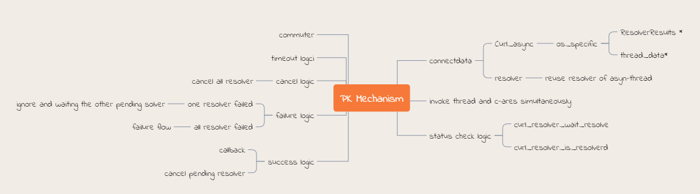

## 背景
我们公司的产品使用 libcurl 作为基础网络库，线上环境中经常会有域名解析失败导致的问题。libcurl 的域名解析默认情况下是调用系统 API 完成的，并且用户的网络环境可能比较复杂，比如：是否连接了代理服务器，是否开启防火墙，域名解析过程是不是被运营商劫持等等。所以对于此类问题，通常是只能在特定的机器和网络环境下复现，非常难确定具体原因。

<!--more-->

排查这类问题中我们也逐步有了一些想法：

1. 网络诊断工具
2. 域名解析备份机制
3. 域名解析 PK 机制

这篇文章主要记录一下我是如何实现 libcurl 域名解析 PK 机制的。

首先需要弄清下面两个问题：
1. libcurl 的域名解析流程
2. 域名解析 PK 流程

## libcurl 的域名解析流程

域名解析是网络连接的第一步，libcurl 使用了一个状态机管理网络连接的每个状态，代码在 multi.c 这个文件中：

```C++
static CURLMcode multi_runsingle(struct Curl_multi *multi,
                                 struct curltime now,
                                 struct Curl_easy *data)
{
    ...
    switch(data->mstate) {
    case CURLM_STATE_INIT:
      /* init this transfer. */
      result=Curl_pretransfer(data);

      if(!result) {
        /* after init, go CONNECT */
        multistate(data, CURLM_STATE_CONNECT);
        Curl_pgrsTime(data, TIMER_STARTOP);
        rc = CURLM_CALL_MULTI_PERFORM;
      }
      break;

    case CURLM_STATE_CONNECT_PEND:
      /* We will stay here until there is a connection available. Then
         we try again in the CURLM_STATE_CONNECT state. */
      break;

    case CURLM_STATE_CONNECT:
      /* Connect. We want to get a connection identifier filled in. */
      Curl_pgrsTime(data, TIMER_STARTSINGLE);
      result = Curl_connect(data, &data->easy_conn,
                            &async, &protocol_connect);
      ...
    case CURLM_STATE_WAITRESOLVE:
      ...
      result = Curl_resolver_is_resolved(data->easy_conn, &dns);
      ...
}
```

CURLM_STATE_CONNECT 这个状态时会发起连接请求 Curl_connect, 解析域名的调用逻辑就封装在这个方法里面。libcurl 的域名解析有同步和异步两种方式，默认是异步的方式。异步域名解析的接口定义在 asyn.h 这个头文件中。

主要接口如下：

```C++
...

/*
 * Curl_resolver_is_resolved()
 *
 * Called repeatedly to check if a previous name resolve request has
 * completed. It should also make sure to time-out if the operation seems to
 * take too long.
 *
 * Returns normal CURLcode errors.
 */
CURLcode Curl_resolver_is_resolved(struct connectdata *conn,
                                   struct Curl_dns_entry **dns);

/*
 * Curl_resolver_getaddrinfo() - when using this resolver
 *
 * Returns name information about the given hostname and port number. If
 * successful, the 'hostent' is returned and the forth argument will point to
 * memory we need to free after use. That memory *MUST* be freed with
 * Curl_freeaddrinfo(), nothing else.
 *
 * Each resolver backend must of course make sure to return data in the
 * correct format to comply with this.
 */
Curl_addrinfo *Curl_resolver_getaddrinfo(struct connectdata *conn,
                                         const char *hostname,
                                         int port,
                                         int *waitp);
...
```

Curl_resolver_getaddrinfos 是域名解析的接口，具体实现有两种方式：asyn-thread 和 asyn-ares; 前者是在开启了一个线程然后调用系统的域名解析API，后者是使用 c-ares 这个库实现异步域名解析。默认情况下，libcurl 使用的是 asyn-thread, 如果你想使用 asyn-ares, 需要打开 USE_ARES 这个编译选项。

Curl_resolver_is_resolved 返回域名解析是否完成，libcurl multi 中有个 hearbeat 就是通过调用这个方法轮询域名解析是否完成。

整体流程图如下：


## 域名解析 PK 流程

c-ares 是一个跨平台异步域名解析库，完整地实现了 DNS 协议标准，没有使用平台相关个API；因此，当我们遇到系统域名解析问题时，很自然地想到了是否可以使用 asyn-ares 做 backup 或者同时发起 asyn-thread 和 asyn-ares 两种解析方式。
但是 libcurl 中默认只能使用一种域名解析方式，也就时说如果打开了 USE_ARES 编译选项，就无法使用 aysn-thread 这种方式做域名解析了。所以这里需要重新定义一个编译选项并实现 asyn 接口。

如何在 libcurl 中实现域名解析 PK 呢？总结一下有以下需要解决的问题：

1. 并行地发起 asyn-thread 和 asyn-ares 两种域名解析请求
2. 如果其中一个解析成功
    - 返回解析结果，状态机更新，继续处理下一个状态
    - 取消另一个正在处理的域名解析请求
3. 解析失败
    - 如果其中一个请求失败了，忽略失败处理逻辑，继续等待另一个域名解析请求返回
    - 如果两个请求都失败了，进行失败处理
4. 取消逻辑
5. 解析状态检测
6. 数据结构更新



## 参考资料
1. [从Chrome源码看DNS解析过程](https://zhuanlan.zhihu.com/p/32531969)
2. https://medium.com/tenable-techblog/remotely-exploiting-zoom-meetings-5a811342ba1d