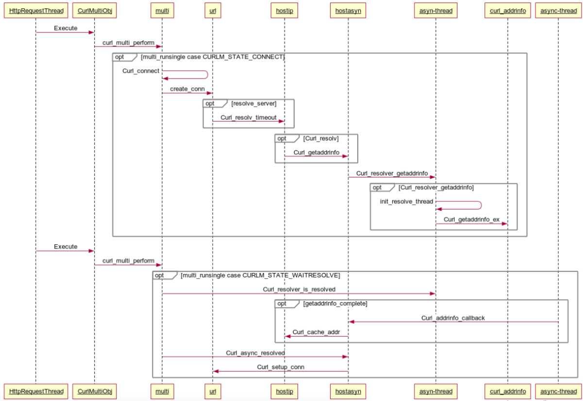

## 背景
我们公司的产品使用 libcurl 作为基础网络库，线上环境中经常会有域名解析失败导致的问题。libcurl 的域名解析默认情况下是调用系统 API 完成的，并且用户的网络环境可能比较复杂，比如：是否连接了代理服务器，是否开启防火墙，域名解析过程是不是被运营商劫持等等。所以对于此类问题，通常是只能在特定的机器和网络环境下复现，非常难确定具体原因。

<!--more-->

排查这类问题中我们也逐步有了一些想法：

1. 网络诊断工具
2. 域名解析备份机制
3. 域名解析PK机制

几个问题：
1. libcurl 的域名解析流程
2. 域名解析 PK 流程

## libcurl 的域名解析流程 

## 域名解析 PK 流程

## 参考资料
1. [从Chrome源码看DNS解析过程](https://zhuanlan.zhihu.com/p/32531969)
2. https://medium.com/tenable-techblog/remotely-exploiting-zoom-meetings-5a811342ba1d