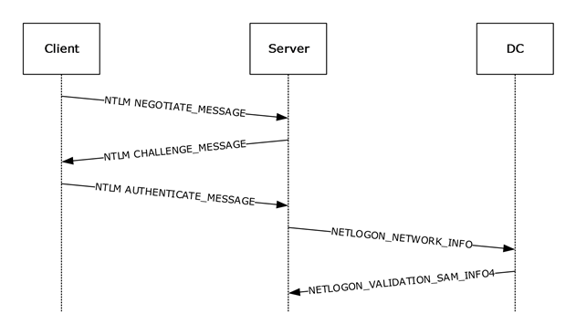

记录项目使用 libcurl 时遇到的一些坑，持续更新！

<!--more-->

## 动态库卸载 Crash
libcurl 作为动态库一部分，在动态库卸载时如果有 pending 的 dns 解析请求可能会导致 Crash。
- [相关issue](https://github.com/curl/curl/issues/997)
- [官方文档说明](https://curl.haxx.se/libcurl/c/curl_global_cleanup.html)

>curl_global_cleanup does not block waiting for any libcurl-created threads to terminate (such as threads used for name resolving). If a module containing libcurl is dynamically unloaded while libcurl-created threads are still running then your program may crash or other corruption may occur. We recommend you do not run libcurl from any module that may be unloaded dynamically. This behavior may be addressed in the future.

## Connection Cache 复用问题
网络切换/中断、App前后台切换，可能会导致 Connection Cache 的 socket 连接实例失效，但是 libcurl 没有针对这种情况做 Connection Cache 的及时清理，导致连接复用时可能会出现连接失败。这个问题在 iOS, Mac 平台上很容易出现。
- [相关讨论](https://curl.haxx.se/mail/lib-2016-07/0032.html)

>I've got a situation where connection cache is kept through internet connection change (Wifi -> 3G for example). After network change cURL will try to reuse the connection from cache and will fail and open a new connection. The problem is that it takes ~20 seconds to understand that the connection was dead.

## WebSocket 支持
主要思路是使用 libcurl 作 https 通信，具体的 websocket 协议解析与封装需要自己实现。但是有个问题，libcurl 官方是不支持 websocket，因此 websocket 请求实例拿到 response 以后。这个实例可能会被 re-use。当然，民间也有一些基于 libcurl 支持 websocket 的讨论。

- https://curl.haxx.se/video/curlup-2017/2017-03-19_05_Michael_Kaufmann_Websocket_support_for_curl.mp4
- https://github.com/bagder/curl/pull/86
- https://gist.github.com/mkauf/5ce3574ce821b2cf02986d4d701bfa86

## NTLM 认证
这次升级 libcurl 到 7.71.1 版本后，NTLM 认证在 Android 和 iOS 上认证都会失败。之前升级 libcurl 到 7.55.1 时也遇到过 NTLM 认证的问题。

相比其他认证方式，NTLM 认证过程更为复杂，整体流程如下图：



Client 和 Server 需要几次“握手”交换认证信息，并且要求这几次“握手”的连接实例是同一个。http(s) 是无状态连接，libcurl 本身也有 connection reuse 机制，所以可能有各种原因会导致，交换 NTLM 认证信息的几次连接可能使用的不是同一个实例，这就会导致认证失败。

我提交过几个 issue 给 libcurl，5911 这个 issue 是官方其中一个版本引入的 regression，我提了一个 PR Fix 了

Issues:
- https://github.com/curl/curl/issues/3647
- https://github.com/curl/curl/issues/5693
- https://github.com/curl/curl/issues/5911

Pull Request: 
- https://github.com/curl/curl/pull/5914

这些使用上的坑也具有指导意义。

### Could not re-use the connection for NTLM challenge, and always create a new connection

#### Root Cause
Connection 42 is still name resolving, can't reuse. So create a new connection 43, which cause NTLM challenge failed, and cause once more redirect. It's very wired because Connection 42 have left intact just now.


#### Solution
define the macro HAVE_GETPEERNAME

#### abnormal logs

```
[my_curl_debug_callback] This: 525811577016 TEXT :Connection #42 to host exchange2016.com left intact
[my_curl_debug_callback] This: 525811577016 TEXT :Issue another request to this URL: 'https://exchange2016.com/EWS/Exchange.asmx'
[my_curl_debug_callback] This: 525811577016 TEXT :Found bundle for host exchange2016.com: 0x7a72130c30 [serially]
[my_curl_debug_callback] This: 525811577016 TEXT :Connection #11 is still name resolving, can't reuse
[my_curl_debug_callback] This: 525811577016 TEXT :Connection #23 is still name resolving, can't reuse
[my_curl_debug_callback] This: 525811577016 TEXT :Connection #24 is still name resolving, can't reuse
[my_curl_debug_callback] This: 525811577016 TEXT :Connection #25 is still name resolving, can't reuse
[my_curl_debug_callback] This: 525811577016 TEXT :Connection #26 is still name resolving, can't reuse
[my_curl_debug_callback] This: 525811577016 TEXT :Connection #29 is still name resolving, can't reuse
[my_curl_debug_callback] This: 525811577016 TEXT :Connection #31 is still name resolving, can't reuse
[my_curl_debug_callback] This: 525811577016 TEXT :Connection #42 is still name resolving, can't reuse
[my_curl_debug_callback] This: 525811577016 TEXT :Hostname exchange2016.com was found in DNS cache
[my_curl_debug_callback] This: 525811577016 TEXT :  Trying 10.100.87.8:443...
[my_curl_debug_callback] This: 525811577016 TEXT :Connected to exchange2016.com () port 443 (#43)
```

#### normal logs

Re-using existing connection! (43) for NTLM challenge

```
[my_curl_debug_callback] This: 5412312248 TEXT :Connection #43 to host exchange2013.com left intact
[my_curl_debug_callback] This: 5412312248 TEXT :Issue another request to this URL: 'https://exchange2013.com/EWS/Exchange.asmx'
[my_curl_debug_callback] This: 5412312248 TEXT :Found bundle for host exchange2013.com: 0x2823928e0 [serially]
[my_curl_debug_callback] This: 5412312248 TEXT :Re-using existing connection! (#43) with host exchange2013.com
[my_curl_debug_callback] This: 5412312248 TEXT :Connected to exchange2013.com () port 443 (#43)
```

### Connection cache is full, closing the oldest one. Which cause could not re-use the connection for NTLM challenge

#### Root Cause

- Connection cache is full, closing the oldest one. So create a new connection 50, which cause NTLM challenge failed, and cause once more redirect. But why Closing connection 49, it seems to the latest one not oldest one.

- websocket connections make the connection cache full, and can not be closed

As following code snippet, for websocket connection we will set the connect_only as true, which will never be candidate connection for close.

```
// conncache.c
struct connectdata *
Curl_conncache_extract_oldest(struct Curl_easy *data) {
    
    ....
    
    while(curr) {
      conn = curr->ptr;

      if(!CONN_INUSE(conn) && !conn->data && !conn->bits.close &&
         !conn->bits.connect_only) {
        /* Set higher score for the age passed since the connection was used */
        score = Curl_timediff(now, conn->lastused);

        if(score > highscore) {
          highscore = score;
          conn_candidate = conn;
          bundle_candidate = bundle;
        }
      }
      curr = curr->next;
    }
    
    ....
    
}
```

#### abnormal logs

```
[my_curl_debug_callback] This: 5412314808 TEXT :Connected to exchange2013.com () port 443 (#49)
[my_curl_debug_callback] This: 5412314808 TEXT :ALPN, offering http/1.1
[my_curl_debug_callback] This: 5412314808 TEXT :TLSv1.3 (OUT), TLS handshake, Client hello (1):
[my_curl_debug_callback] This: 5412314808 TEXT :TLSv1.3 (IN), TLS handshake, Server hello (2):
[my_curl_debug_callback] This: 5412314808 TEXT :TLSv1.2 (IN), TLS handshake, Certificate (11):
[my_curl_debug_callback] This: 5412314808 TEXT :TLSv1.2 (IN), TLS handshake, Server key exchange (12):
[my_curl_debug_callback] This: 5412314808 TEXT :TLSv1.2 (IN), TLS handshake, Server finished (14):
[my_curl_debug_callback] This: 5412314808 TEXT :TLSv1.2 (OUT), TLS handshake, Client key exchange (16):
[my_curl_debug_callback] This: 5412314808 TEXT :TLSv1.2 (OUT), TLS change cipher, Change cipher spec (1):
[my_curl_debug_callback] This: 5412314808 TEXT :TLSv1.2 (OUT), TLS handshake, Finished (20):
[my_curl_debug_callback] This: 5412314808 TEXT :TLSv1.2 (IN), TLS handshake, Finished (20):
[my_curl_debug_callback] This: 5412314808 TEXT :SSL connection using TLSv1.2 / ECDHE-RSA-AES256-SHA384
[my_curl_debug_callback] This: 5412314808 TEXT :ALPN, server did not agree to a protocol
[my_curl_debug_callback] This: 5412314808 TEXT :Server certificate:
[my_curl_debug_callback] This: 5412314808 TEXT : subject: CN=*.com
[my_curl_debug_callback] This: 5412314808 TEXT : start date: Apr 22 00:00:00 2020 GMT
[my_curl_debug_callback] This: 5412314808 TEXT : expire date: Apr 22 23:59:59 2022 GMT
[my_curl_debug_callback] This: 5412314808 TEXT : subjectAltName: host "exchange2013.com" matched cert's "*.com"
[my_curl_debug_callback] This: 5412314808 TEXT : issuer: C=GB; ST=Greater Manchester; L=Salford; O=Sectigo Limited; CN=Sectigo RSA Domain Validation Secure Server CA
[my_curl_debug_callback] This: 5412314808 TEXT : SSL certificate verify ok.
[my_curl_debug_callback] This: 5412314808 TEXT :Server auth using NTLM with user 'foo-bar'
[my_curl_debug_callback] This: 5412314808 HEADER_OUT :POST /EWS/Exchange.asmx HTTP/1.1
[my_curl_debug_callback] This: 5412314808 TEXT :Mark bundle as not supporting multiuse
[my_curl_debug_callback] This: 5412314808 HEADER_IN :HTTP/1.1 401 Unauthorized
[my_curl_debug_callback] This: 5412314808 HEADER_IN :Server: Microsoft-IIS/7.5
[my_curl_debug_callback] This: 5412314808 HEADER_IN :request-id: 9811034b-32e4-45e5-b300-5be1efb8d8f3
[my_curl_debug_callback] This: 5412314808 HEADER_IN :WWW-Authenticate: balabalabalabalabalabalabalabalabalabala
[my_curl_debug_callback] This: 5412314808 HEADER_IN :WWW-Authenticate: Negotiate
[my_curl_debug_callback] This: 5412314808 HEADER_IN :X-Powered-By: ASP.NET
my_curl_debug_callback] This: 5412314808 HEADER_IN :X-FEServer: WIN-1TRC9B5MS6A
[my_curl_debug_callback] This: 5412314808 HEADER_IN :Date: Thu, 16 Jul 2020 19:02:54 GMT
[my_curl_debug_callback] This: 5412314808 HEADER_IN :Content-Length: 0
[my_curl_debug_callback] This: 5412314808 HEADER_IN :
[my_curl_debug_callback] This: 5412314808 TEXT :Connection cache is full, closing the oldest one.
[my_curl_debug_callback] This: 5412314808 TEXT :Closing connection 49
[my_curl_debug_callback] This: 5412314808 TEXT :TLSv1.2 (OUT), TLS alert, close notify (256):
[my_curl_debug_callback] This: 5412314808 TEXT :Issue another request to this URL: 'https://exchange2013.com/EWS/Exchange.asmx'
[my_curl_debug_callback] This: 5412314808 TEXT :Found bundle for host exchange2013.com: 0x2823b9680 [serially]
[my_curl_debug_callback] This: 5412314808 TEXT :Hostname exchange2013.com was found in DNS cache
[my_curl_debug_callback] This: 5412314808 TEXT :  Trying 10.100.87.7:443...
[my_curl_debug_callback] This: 5412314808 TEXT :Connected to exchange2013.com () port 443 (#50)
```

### NTLM Authenticate always failed in curl 7.71.1 if Use proxy without username and password

开启抓包工具使用没有用户名或密码的代理服务器，NTLM 就认证就会失败。

分析如下：

this code snippet seems to the condition alway as true if i have config proxy server without password, which maybe cause failed to reuse the connections for NTLM challenge.

```
#ifndef CURL_DISABLE_PROXY
        /* Same for Proxy NTLM authentication */
        if(wantProxyNTLMhttp) {
          /* Both check->http_proxy.user and check->http_proxy.passwd can be
           * NULL */
          if(!check->http_proxy.user || !check->http_proxy.passwd)
            continue;

          if(strcmp(needle->http_proxy.user, check->http_proxy.user) ||
             strcmp(needle->http_proxy.passwd, check->http_proxy.passwd))
            continue;
        }
        else if(check->proxy_ntlm_state != NTLMSTATE_NONE) {
          /* Proxy connection is using NTLM auth but we don't want NTLM */
          continue;
        }
#endif
```

#### abnormal logs

```
Line 6374: [18048:16268:09-04/10:49:34.941:INFO:(389)]TEXT :Found bundle for host xxx.com: 0xf781740 [serially]
Line 6376: [18048:16268:09-04/10:49:34.941:INFO:(389)]TEXT :Re-using existing connection! (#8) with proxy 127.0.0.1
Line 6378: [18048:16268:09-04/10:49:34.941:INFO:(389)]TEXT :Connected to 127.0.0.1 (127.0.0.1) port 8888 (#8)
Line 6380: [18048:16268:09-04/10:49:34.941:INFO:(389)]TEXT :Server auth using NTLM with user 'balabala'
Line 6382: [18048:16268:09-04/10:49:34.941:INFO:(389)]HEADER_OUT :POST /EWS/Exchange.asmx HTTP/1.1
Line 6385: [18048:16268:09-04/10:49:35.018:INFO:(389)]TEXT :Mark bundle as not supporting multiuse
Line 6387: [18048:16268:09-04/10:49:35.018:DEBUG:(362)]HEADER_IN :HTTP/1.1 401 Unauthorized
Line 6391: [18048:16268:09-04/10:49:35.018:DEBUG:(362)]HEADER_IN :Server: Microsoft-IIS/8.5
Line 6395: [18048:16268:09-04/10:49:35.018:DEBUG:(362)]HEADER_IN :request-id: 8ae68c1b-25f1-449f-b911-0808b135cb44
Line 6399: [18048:16268:09-04/10:49:35.018:DEBUG:(362)]HEADER_IN :WWW-Authenticate: NTLM TlRMTVNTUAACAAAAGAAYADgAAAAFgomiPXW5AdNSBywAAAAAAAAAAAoBCgFQAAAABgOAJQAAAA9FAFgAQwBIAEEATgBHAEUAMgAwADEANgACABgARQBYAEMASABBAE4ARwBFADIAMAAxADYAAQAeAFcASQBOAC0ARgA2AEYAMgBOAEkATQBOAFMASABNAAQAMABlAHgAYwBoAGEAbgBnAGUAMgAwADEANgAuAHMAdQB6AGgAbwB1AC4AegBvAG8AbQADAFAAVwBJAE4ALQBGADYARgAyAE4ASQBNAE4AUwBIAE0ALgBlAHgAYwBoAGEAbgBnAGUAMgAwADEANgAuAHMAdQB6AGgAbwB1AC4AegBvAG8AbQAFADAAZQB4AGMAaABhAG4AZwBlADIAMAAxADYALgBzAHUAegBoAG8AdQAuAHoAbwBvAG0ABwAIAEvkOQZmgtYBAAAAAA==
Line 6403: [18048:16268:09-04/10:49:35.018:DEBUG:(362)]HEADER_IN :WWW-Authenticate: Negotiate
Line 6407: [18048:16268:09-04/10:49:35.018:DEBUG:(362)]HEADER_IN :X-Powered-By: ASP.NET
Line 6411: [18048:16268:09-04/10:49:35.018:DEBUG:(362)]HEADER_IN :X-FEServer: WIN-F6F2NIMNSHM
Line 6415: [18048:16268:09-04/10:49:35.018:DEBUG:(362)]HEADER_IN :Date: Fri, 04 Sep 2020 02:49:35 GMT
Line 6419: [18048:16268:09-04/10:49:35.018:DEBUG:(362)]HEADER_IN :Content-Length: 0
Line 6423: [18048:16268:09-04/10:49:35.018:DEBUG:(362)]HEADER_IN :Proxy-Support: Session-Based-Authentication
Line 6427: [18048:16268:09-04/10:49:35.018:DEBUG:(362)]HEADER_IN :
Line 6429: [18048:16268:09-04/10:49:35.018:INFO:(389)]HEADER_IN :
Line 6431: [18048:16268:09-04/10:49:35.018:INFO:(389)]TEXT :Connection #8 to host 127.0.0.1 left intact
Line 6433: [18048:16268:09-04/10:49:35.018:INFO:(389)]TEXT :Issue another request to this URL: 'https://xxx.com/EWS/Exchange.asmx'
Line 6435: [18048:16268:09-04/10:49:35.018:INFO:(389)]TEXT :Found bundle for host xxx.com: 0xf781740 [serially]
Line 6437: [18048:16268:09-04/10:49:35.018:INFO:(389)]TEXT :NTLM-proxy picked AND auth done set, clear picked!
Line 6439: [18048:16268:09-04/10:49:35.018:INFO:(389)]TEXT :Hostname 127.0.0.1 was found in DNS cache
Line 6441: [18048:16268:09-04/10:49:35.018:INFO:(389)]TEXT :  Trying 127.0.0.1:8888...
Line 6445: [18048:16268:09-04/10:49:35.029:INFO:(389)]TEXT :Connected to 127.0.0.1 (127.0.0.1) port 8888 (#13)
Line 6447: [18048:16268:09-04/10:49:35.029:INFO:(389)]TEXT :allocate connect buffer!
Line 6449: [18048:16268:09-04/10:49:35.029:INFO:(389)]TEXT :Establish HTTP proxy tunnel to xxx.com:443
```

出来混早晚是要还的，技术债务也是如此。少一些 Workaround，多一点 Root Cause。