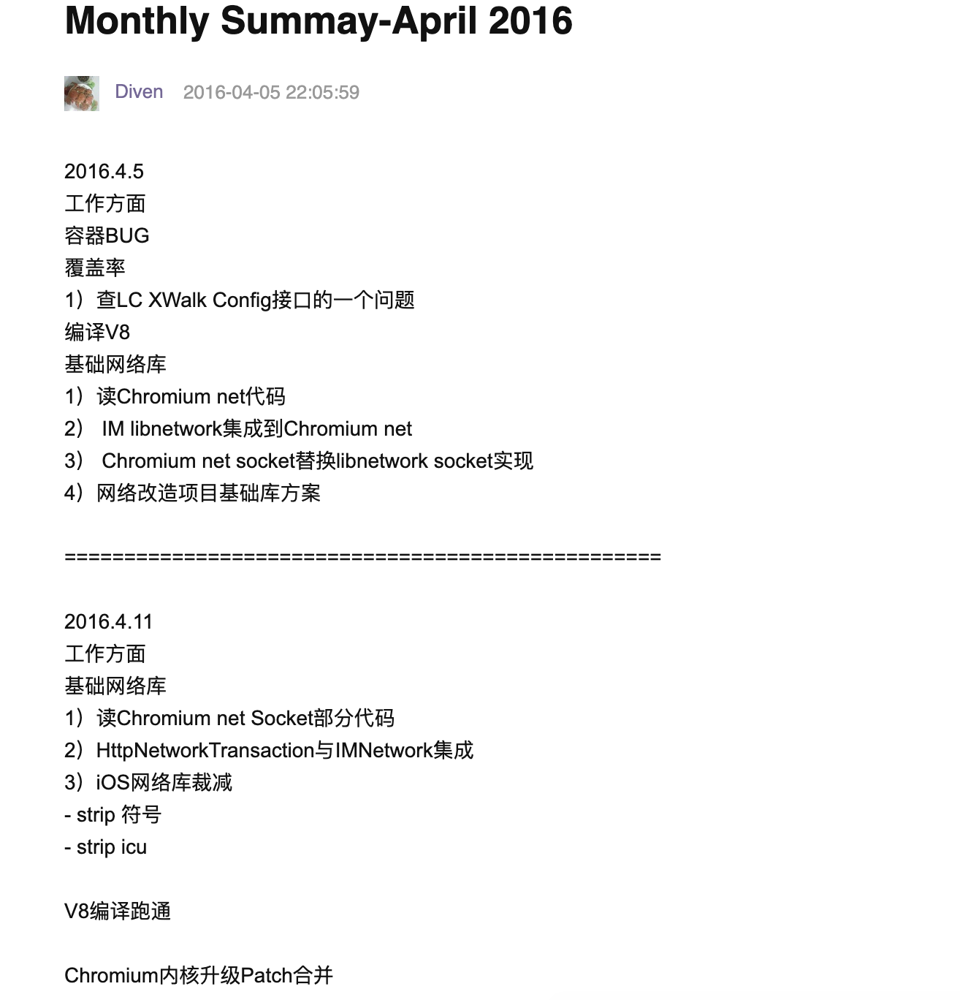
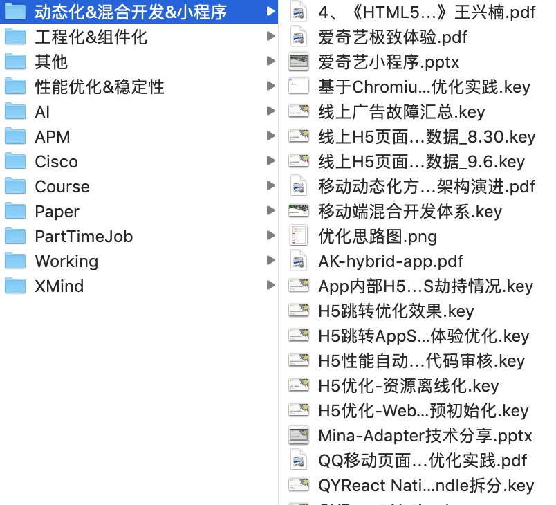
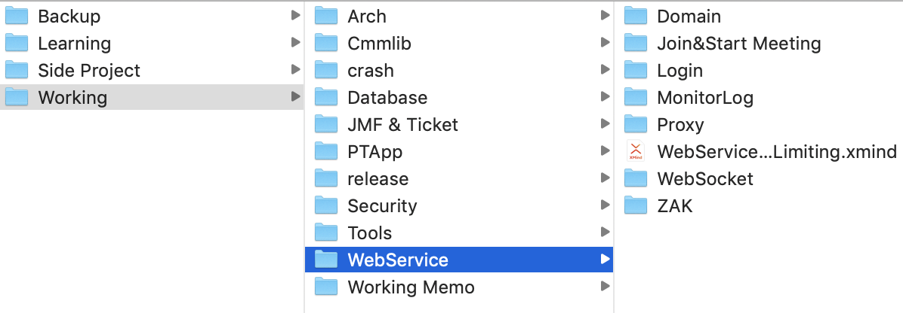

我一直有记笔记的习惯，但是回头看来大多数情况下我的笔记质量很一般。

## 手写
刚开始实习时，用最原始的办法记笔记：手写。主要目的是整理思路、记下每周要做的事情等等。这种方式大概持续了 2-3 年，用完了好几个笔记本，但是基本没有沉淀。毕业、搬家、换工作几次事件后，基本把笔记本都弄丢了。

## 云笔记 + 豆瓣
开始有意识用云笔记记笔记，用过印象笔记、豆瓣。便于多端同步，现在来看当年在豆瓣上的笔记，基本属于日常事务流水账，主要汇总了每周/月所做的工作；基本没有知识总结，沉淀。

## Git 托管
各种云笔记产品其实挺好用的，但是我使用过各种记笔记方法后，还是最倾向于使用 Git 托管笔记。

原因有以下几点：

1. 记事本 + markdown 轻量简洁的体验
2. 便于保存各种 PPT, PDF 等文档
3. 有提交历史，方便回滚

这个习惯是从爱奇艺移动架构组工作开始的，当时我们每周都需要 PPT 总结本周工作，那段时间我积累了大量知识沉淀。

## 总结
来了 Zoom 以后，发现很多优秀的同事都有记笔记的习惯，我们每个 task 在具体写代码之前，都需要写 Design Doc., Test Case 等文档，这对我们思考非常有用。同时也可以沉淀大量文档，文档的重要性不言而喻，长远来看一些基础、重要的工作文档化以后，可以让我们工作的更轻松。

比如今天无意中看到一位技术支持同事的 Wiki Space 写了大量详尽的文档，包括常用工具用发、常见问题的分析、业务背景总结、技术沉淀等等；这些文档一定有助于让他后面的工作更轻松高效。

我也梳理了一下我的工作文档目录。财富是一点点积累出来的，知识也是，希望今年的工作过程中能注意多总结，多沉淀。

