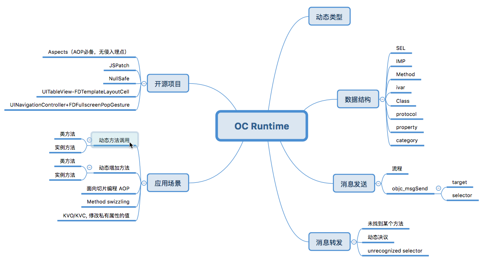
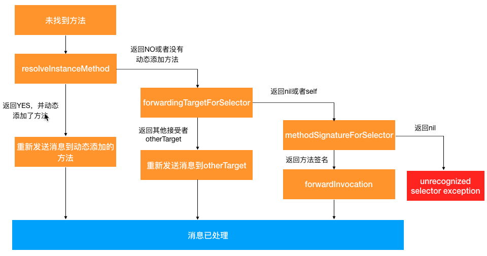

## 背景

Runtime 是 Objective-C 特有的机制，iOS 进阶必须要掌握的知识点，面试过程中也会经常问。实际上也有很多开源库中，大量地使用 Runtime 来实现各种需求，比如大名鼎鼎的 JSPatch，YYModel 等。本文是我学习的笔记或随笔，内容可能比较散杂，由于 OC Runtime 内容很多，所以本文会不间断更新。先上一张思维导图，感受一下 OC Runtime 大体包含了哪些知识点。



<!--more-->

## 消息发送

消息发送是OC作为动态类型语言的一个核心特性，OC方法调用并不是编译期间就确定的，而且是运行期间动态地决定调用哪个方法。看一个OC消息发送的例子：初始化了一个Person实例，然后直接调用Person类的eat方法。

```objective-c
Person *p = [[Person alloc] init];
[p eat];
```
再看一下对应的底层实现:

```objective-c
objc_msgSend(p, @selector(eat));
```
主要流程：
- 查找selector
- 消息发送 objc_msgSend

本质上OC方法调用是通过objc_msgSend给target发送消息，如果这个消息没有对应的实现，就回进入消息转发流程。

## 消息转发

开发过程中经常会遇到 **** unrecognized selector sent to instance 这样的崩溃，表明你曾向某个对象发送了一条无法解读的消息。当一个对象收到无法解读的消息后会如何处理，也就是说对象无法响应选择子(方法)，这时就要进入到消息转发机制的流程（动态方法决议）, 整体流程如下图：



## 动态方法调用

实际项目开发时，或多或少都会需要用到动态方法调用。我在项目开发中有两个场景使用了动态方法调用：
- 想使用某个基础库的功能，但是改库并没有暴露头文件
- 使用某个基础库，但是不希望在编译期间引入对这个库的依赖

动态方法调用的适用场景还有更多，比如我们想要使用系统的私有方法，也可以通过动态方法调用的机制。不过这样有审核风险，所以一般不推荐使用。

### 实例方法调用流程
代码片段:
```objective-c
Class Person =NSClassFromString(@"Person");
if (Person) {    
    id person = [[Person alloc] init];
    if (person == nil) {
        return;
    }    
    NSMethodSignature *eat = [person methodSignatureForSelector:NSSelectorFromString(@"eat:")];
    NSInvocation *invocation = [NSInvocation invocationWithMethodSignature:eat];
    int cnt = 10;
    [invocation setArgument:&(cnt) atIndex:2];
    invocation.selector = NSSelectorFromString(@"eat:")
    invocation.target = person;
    [invocation invoke];
}
```
流程总结:
- 获取 Class 定义 (NSClassFromString)
- 实例化 Class
- 定义实例方法签名 (methodSignatureForSelector)
- 创建 NSInvocation (invocationWithMethodSignature)
- 设置 invocation 参数 (setArgument，index从2开始)
- 获取待调用方法 selector (NSSelectorFromString)
- 设置 invocation 的 selector
- 设置 invocation 的 target (Class 实例)

## 修改历史
|修改时间|说明|
|--|--|
|2018-06-25|创建文档|
|2018-06-26|增加思维导图|
|2018-06-27|增加消息转发部分|

## 更多资料
- [Objective-C对象模型及应用](http://blog.devtang.com/2013/10/15/objective-c-object-model/)
- [面向切面编程之 Aspects 源码解析及应用](http://wereadteam.github.io/2016/06/30/Aspects/)
- [iOS 消息转发流程](https://juejin.im/post/5a30c6fdf265da4319564272)