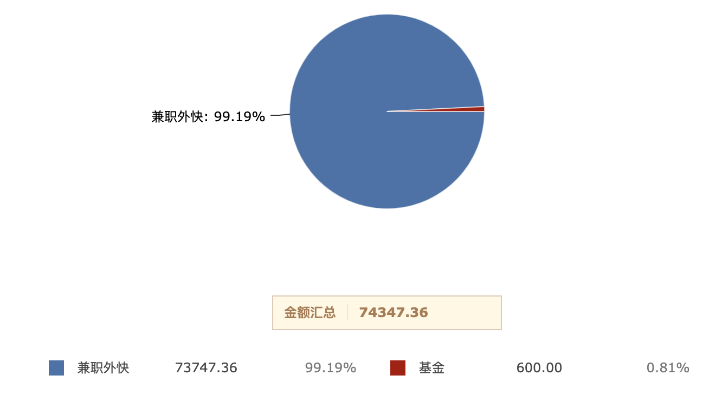
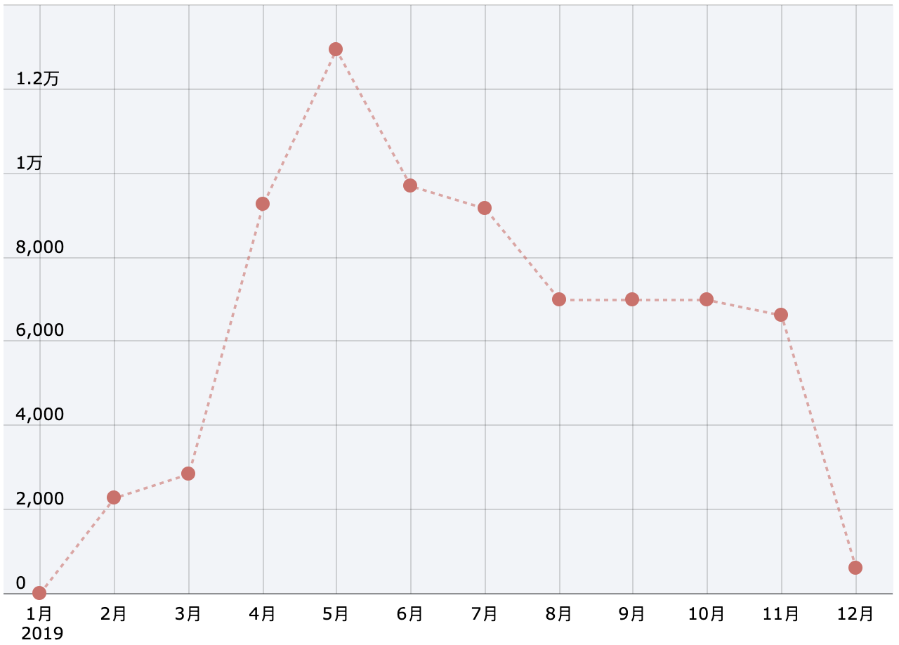

### 总结 (负面)
平淡、稳定，有点颓的一年, 去年立下的 flag 基本没有完成：
- 早起
    - 起床比较随性，经常导致儿子上学迟到
- 坚持写文章
    - 仅写了 2-3 篇文章，质量还非常粗糙
- 深度思考
    - 除了需要解决项目问题时，其余时间基本没有思考
- 步行或跑步
    - 比较懒，跑步计划基本没有完成，只跑了一个半马
- 多读书
    - 仅读了几本猎奇类的书
- 学会情绪管理
    - 经常对儿子吼

###  总结 (正面)
- 调试能力++，学会使用 windbg 和 IDA 基本用法，能解决大部分 Crash 问题
- 开始关注理财投资

<!--more-->

### 调试
学会了调试几板斧，大部分 Crash 能自己搞定了

### Golang
用 Golang 给公司写了一个日志解密服务，算是学习了一门新的编程语言

### 压力
9-10 月份应该是工作压力最大的时间段，zoom 在中国被封，紧急被赶鸭子上架解决这个问题，期间压力大到睡不着觉

### 给自己挖坑
发版前提交代码没有仔细测试 && review，影响了各个平台的主要功能。发版当天还请假出去玩了，release 群里很多人都在找，甚至惊动到 site manager

### 红楼梦
开车上下班的路上基本都在听红楼梦，主题曲也循环听了很多很多遍

### 孩子入园
儿子到了入园年纪，8月份开始提前上暑期适应班。每次把儿子送教室他都哭哭啼啼不愿意让我走。老婆也开始去上班了，家里的生活节奏跟以前完全不一样了。

### 严重违章
严重超速违章两次被扣了两个 12 分，体验了一把满分学习

### 游泳
学会了蛙泳，虽然水平很菜，但是对于旱鸭子的我已经算是一个突破

### 基金定投
开始接触基金定投，投资理财意识开始萌芽，以后每年会定投沪深300

### 股票兑现
公司上市，行权了 25% 的期权，价值大概 50 万左右吧，但是因为流程原因还迟迟未到账

### 副业收入
全年副业收入74347.36, 其中主要收入还是来自兼职写代码，收入73747.36，占比99.19%；兼职写代码耗费时间较多，也会比较累，目前已经放弃所有兼职写代码的收入。

2020年主要精力放在全职工作上，业余时间做基金定投。12月份开始试玩基金定投，截止到2019年12月31日，基金收入 大约600 左右，因为是前期摸索阶段，收益率较低，但是投入个人精力很少，风险在可接受范围内，是一个性价比很高的提高收入方式。

每月收入明细如下:

### 读过最好的书
- 《红楼梦》

### 看过最好的纪录片
- 冒险雷探长

### 新年 flag
- 看 2-3 部高分纪录片
- 保持读书/听书习惯
- 1-2 周写一篇博客，书写有助于思考
- 每晚坐在书桌前至少半小时
- 尽量控制情绪，不要乱发脾气
- 买改善房
- 带老婆孩子去一次日本
- 工作日保证7点左右起床

#### 理财计划
1. 资金计划 10w+
2. 周期1年
3. 期望收益 10%+
4. 基金分布
    - 宽基
        - 天弘沪深300ETF联接C
        - 上证50指数C
    - 科技
        - 华夏中证5G通信主题ETF联接C
        - 天弘中证电子指数C
        - 天弘中证计算机主题指数C
        - 华宝科技ETF联接C
        - 易方达信息混合
        - 宝盈互联网沪港深灵活配置混合
    - 医药
        - 富国中证医药主题指数
    - 消费
        - 景顺长城内需增长贰号混合
        - 易方达消费行业股票
    - 证券
        - 南方中证全指证券公司ETF联接C
    - 人工智能
        - 融通中证人工智能主题
    - 创业板
        - 天弘创业板ETF联接C
    - 港股
        - 华夏沪港通恒生ETF联接C
    - 主动基金
        - 交银施罗德阿尔法核心混合
        - 兴全合润分级混合
    - 黄金
        - 易方达黄金

#### 身体健康
- 少喝酒、保持身体健康、体检一次
- 改善饮食结构，少油腻，少盐
- 坚持定期跑步
- 争取每天午睡，晚上11:00左右睡觉，最晚不要超过11:30 