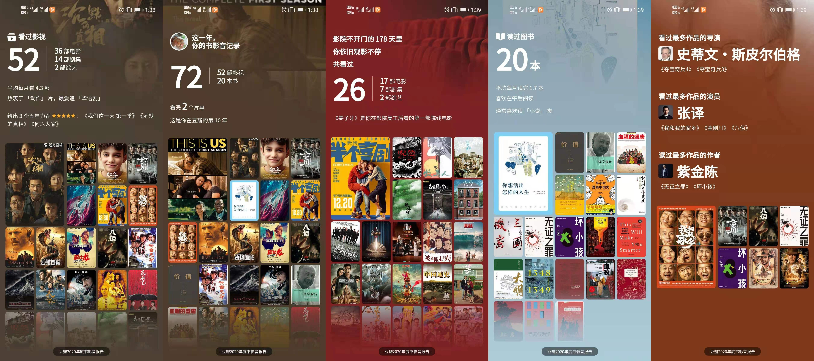

先看看去年立的 flag 的完成情况

### 2019年 flag
- 看 2-3 部高分纪录片
    - 零散地看了《一本好书》、李永乐老师、PaperClip、一席演讲 等
    - 需要明确要看什么纪录片，并且很好利用碎片化时间
<!--more-->
- 读书/听书，电台
    - 每天上下班基本都会听书，今年听了这些：
        - 聊斋志异
        - 红楼梦
        - 鬼吹灯
        - 美的沉思
        - 价值投资
        - 童林传
        - 大唐惊雷
        - 四世同堂
    - 三好坏男孩
    - 故事 FM
- 1-2 周写一篇博客，书写有助于思考
    - 全年写了 13 篇 blog，主要是工作中遇到的问题沉淀，比如 网络、security、libcurl 等
- 每晚坐在书桌前至少半小时
    - 喝酒+晃晃悠悠频率有高
- 尽量控制情绪，不要乱发脾气
    - 继续加油
- 买改善房
    - 完成
- 带老婆孩子去一次日本
    - 疫情原因今年一年基本都没出门，只去了一次九华山
- 工作日保证 7点左右起床

### 理财计划
1. 资金计划 10w+
1. 周期1年
1. 期望收益 10%+

基本完成，今天收益 1w 左右，年中买房清仓一次。不然会赚的更多，今年计划基本完成。

### 身体健康
- 少喝酒、保持身体健康、体检一次
    - 跟同事酒局有点多，要控制频率
- 改善饮食结构，少油腻，少盐
    - 少吃了不少腌制类食物，经常吃公司的酸奶水果捞和减肥餐，还需要减少聚餐频率
- 坚持定期跑步
    - 天气冷的时候没有跑
- 争取每天午睡，晚上 11:00 左右睡觉，最晚不要超过 11:30 
    - 工作日的时候能做到早睡早起

***

## 2020 年回顾盘点

### 买房

### 兵棋推演项目

赚了 10w 块，吸取了很多教训。

1. 极其耗费时间和精力，性价比极地。应该多思考如何增加被动收入。
1. 不能轻易相信任何人，无脑地跟任何人掏心掏肺，会被别有用心的人利用。

### libcurl patch

提交了一个 patch 给 libcurl

https://github.com/curl/curl/pull/5914

### 917 学习小组

难忘的封闭学习体验

### 跑步

### 身体健康

一堆亚健康问题：轻度脂肪肝、尿酸高、高血压等等。急需调整饮食结构、生活方式。

## 2021 年 flag

### 理财 （基金定投）
    - 计划投入 50W
    - 预期收益率 20%

### 装修

### 跑步，控制体重在 60kg 以内

### 减少体检异常指标

### 陪儿子一起学习钢琴课程

### 学完英语流利说：商务英语

### 学完 CS155

### 使用日程管理 App，做好任务清单、计划管理

### 每个月看完两本书
    - 用思维导图整理读书心得

### 每周/每月总结复盘
    - 计划完成情况
    - 思考总结
    - 输出 PPT

***

## 常用 App 年度总结

### 音乐

### 豆瓣

### 支付宝