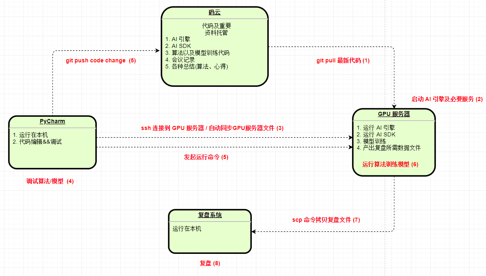

先知.兵圣人机对抗赛是军方组织的兵棋 AI 对抗赛，目前只是在军方内部开放，我们是从某个外包上市公司接到这个项目的，上游需求方是某地方军事院校，情况比较复杂。很显然这个项目最终没有谈成，但这个比赛本身以及谈项目过程中的一些经验教训值得记录并反思。

<!--more-->

## 比赛相关

### 离线训练引擎
主办方提供的离线训练环境，包括陆战和海战两部分，模拟实现真实比赛环境接口，比如获取态势信息，提交动作等，并提供了几个 Demo。参赛队伍只要专注 AI 算法就可以了，不得不说主办方提供的技术支持还是很到位的。

### 复盘系统
离线训练引擎不能实时展示作战细节，只是把作战过程的每一步数据都保存到一个 json 文件中。使用主办方提供的复盘系统，可以对这个 json 文件可视化，复盘系统是用 java 写的 web 服务，启动服务后用浏览器访问即可。

### 算法
算法是这次比赛的核心点，我查阅了一些论文，以往的参赛队伍的算法是基于规则，顶多就是基于数据挖掘的方式。所谓基于规则，简单地说就是把兵棋规则用代码描述一遍，代码量会比较大，但是整体逻辑很容易被看出来，所以很难战胜人类选手。而主办方是希望参赛队伍基于 AI (深度强化学习) 实现并训练模型完成比赛，还特别强调最终胜出队伍中，优先对使用强化学习算法的队伍给予经费支持。

### Workflow
算法实现、离线训练、复盘、代码托管等整体流程大体如下：

## 一些经验教训
- 外包项目一定会有各种撕逼，包括但是不限于费用问题、合同细节、验收标准等等。所以接外包项目通常劳心劳力，投入产出比极低
- 除非项目本身特别有意义，比如恰好可以用你刚学的新技术练练手，或者对你的公司各种资质提升有价值 （需求方是政府、军方等大粗腿）
- 多方转包的项目坚决不能碰，单个需求方撕逼已经够累了，多方转包后撕逼难度和恶心度指数增长
- 不是一类人，千万别往一起凑。跟需求方/合作方沟通 1-2 次基本就大体了解对方办事风格，觉得不合适就赶紧终止合作。比如这次合作过程中我们就被各种小细节上恶心，最终决定终止合作！