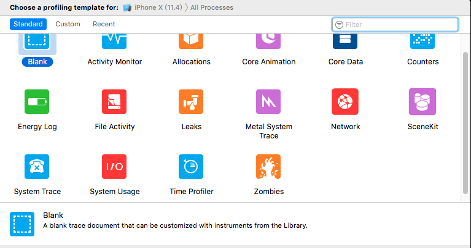
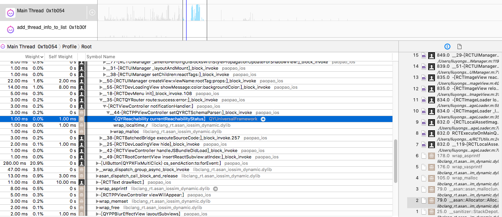
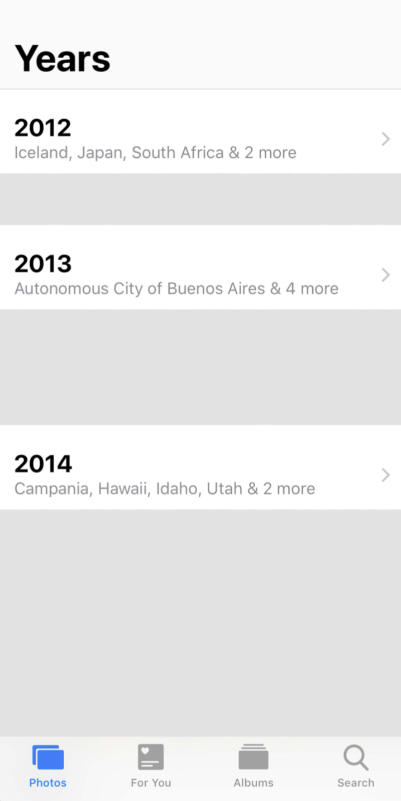
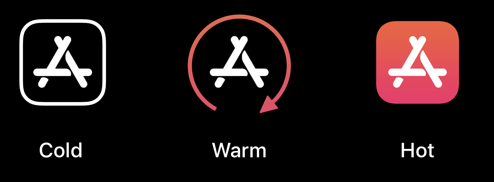
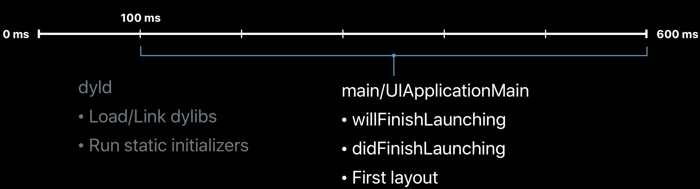
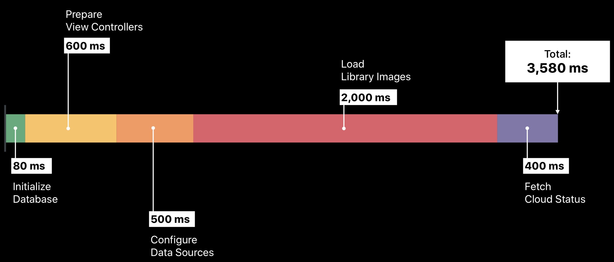
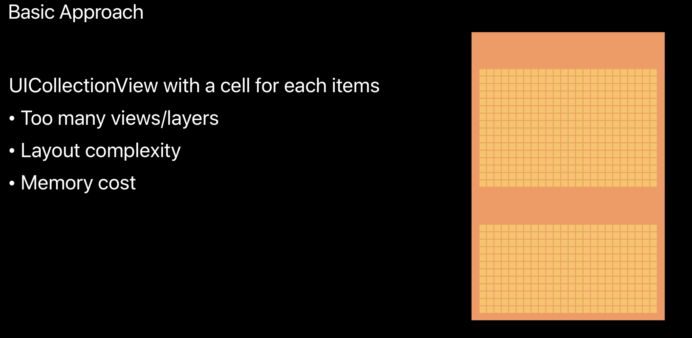

本文内容基于 [Practical Approaches to Great App Performance](https://developer.apple.com/videos/play/wwdc2018/407/) 整理，这个Session主要介绍App 性能优化相关的问题，包括如何使用 Instruments 和其他工具解决性能问题，另外作者还介绍了他们对Xcode和Photos性能调优的一些实践经验。

> All apps benefit from a focus on performance and an increase in overall responsiveness. This information packed session gives you strategies for fixing performance problems using Instruments and other tools. Additionally, get practical advice based on experience in tuning Apple's own apps including Xcode and Photos on iOS.

<!-- more -->

整个Presentation分为两个部分，第一部分是一位开发Xcode的老哥，主题是Approaching Performance A framework for getting started，其实就是介绍了性能调优的一些基本套路。

## Measure

首先性能调优最重要的是Measure。在解决具体的性能问题前，你需要基于baseline标准来Measure，问题解决后也需要根据这个标准来确定问题是否已经修复。

解决性能问题的具体流程是什么呢？先看一下我们是怎么修复传统的功能性bug的：

### Bug修复
- 重现问题
- Debug
- 修改代码
- 重复上述过程

### 性能问题修复
- 重现问题
- Profile， 使用工具找到性能瓶颈
- 修改代码
- 重复上述过程

### Types of Performance Work
- Major Regression，推荐使用自动化性能测试脚本，检测每个版本的性能问题，防止Regression
- Off Target
- 设计缺陷，Review核心模块的设计，必要时重新设计实现

性能测试和功能测试同样重要，项目开发中需要制定性能指标。

## Test
### Unit
- Benchmark
- Isolate issues
- Pinpoints regressions

### Integration
- 用户体验
- dependencies
- side effects

## Profile
### Instrument 
作者演示了怎么使用Instrument profiling并解决Xcode启动时的一个问题。

Instrument中有很多工具，其中最重要的是Time Profiler。Time Profiler attach到进程后，会收集该进程相关的性能数据并动态展示，比如调用栈。

## Common Solutions
- Defer，比如延迟加载
- Batch
- Share results
- Fewer views
- direct observation
- prefer records to dictionaries

第一部分就到这里了，简单总结一下，老哥他通过对比修复常规bug的流程，说明了解决性能问题的流程是啥样。然后从Measure，Test，Profiling几个角度介绍了性能优化的思路，最后给出了几个Common的Best Practice，另外整个Presentation夹杂了很多作者本人对性能优化的理解和看法，很多点没有写在PPT里面，所以我没有记下来了。

***

下面是第二部分，这位老哥分享Photos中的一些性能问题案例，这部分应该挺有实际的参考价值。

## Photos App的性能问题
先看一下Photos这个APP长啥样，照片可以按照拍摄地点，时间等维度排列。

当照片数量很多，加载照片时等待时间可能很长。

## Great User Experience
- Responsiveness
- Smooth animations

## 实践经验
### App启动优化
- 目标
    - 即时
    - No spinner
    - No placeholders

- 三种启动方式
    - Cold: 首次启动
    - Warm: 杀进程后重启
    - Hot: Resume

- 启动时间测量 点击App图标到可以正常操作(交互)之间的时间段，主要包括dyld和main/UIApplicationMain启动时间

- 流程优化
    - 数据预加载
    - Prepare View Controller
    - Configure Datasource

### Building Collections/Years
- 非常复杂的View
    - Thousands of pictures displayed 
    - Live updates
    - Animations
    - Gestures

- Principles
    - Be Lazy
    - Be proactive
    - Be constant
    - Be timely

- 常规方法使用UICollectionView的问题
    - view/layer过多
    - 布局复杂
    - 内存消耗过大

- 优化方案
    - Rendered strips
    - display as a single image

