本文内容基于WWDC 2018中 [Understanding Crashes and Crash Logs](https://developer.apple.com/videos/play/wwdc2018/414/) 整理的。下面这段是关于该视频的简介，这个Session主要介绍iOS Crash相关的知识：如何分析crash logs，怎么调试和修复crash问题，比如难以重现的内存问题和多线程问题。

>Sudden app crashes are a source of bad user experience and app review rejections. Learn how crash logs can be analyzed, what information they contain and how to diagnose the causes of crashes, including hard-to-reproduce memory corruptions and multithreading issues.

<!-- more -->

## Fundamentals
### 什么是Crash，为什么会产生crash？
- impossible for CPU to execute code
- Operating system is enforcing a policy，为了保证系统流畅性，操作系统会kill 掉内存占用过多的App
- Programming language is preventing failure, 比如assert 
- Developer is preventing failure

### Crash长啥样

当App发生crash时, attached的debugger会暂停App的运行，并定位的crash位置。

详细看一下crash栈，这里是App启动入口

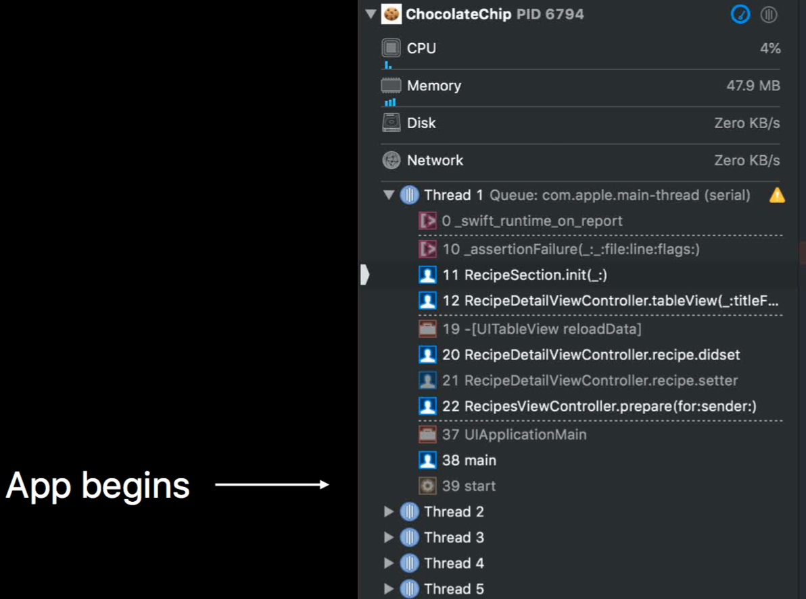

这里是crash的具体位置

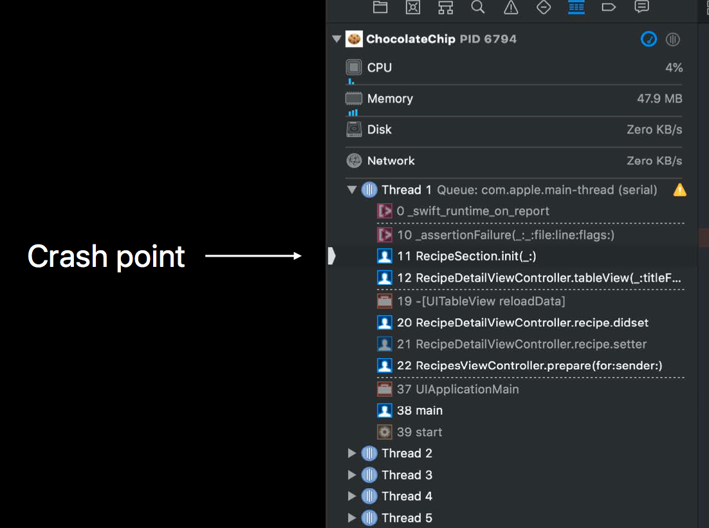

发生crash时,debugger会收到signal，然后暂停App的运行,显示crash的调用栈

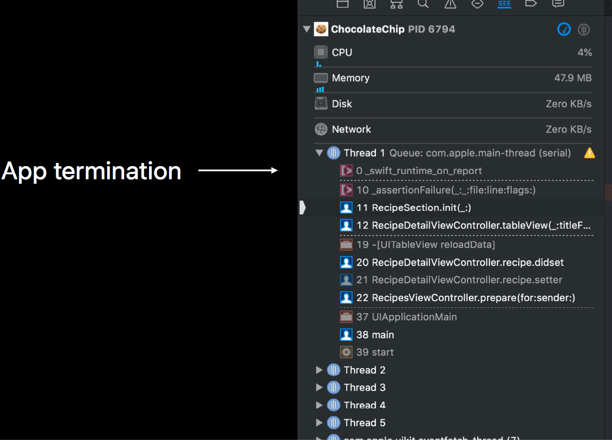

如果当前没有attached的debugger，系统会吧crash堆栈信息dump到一个log文件中

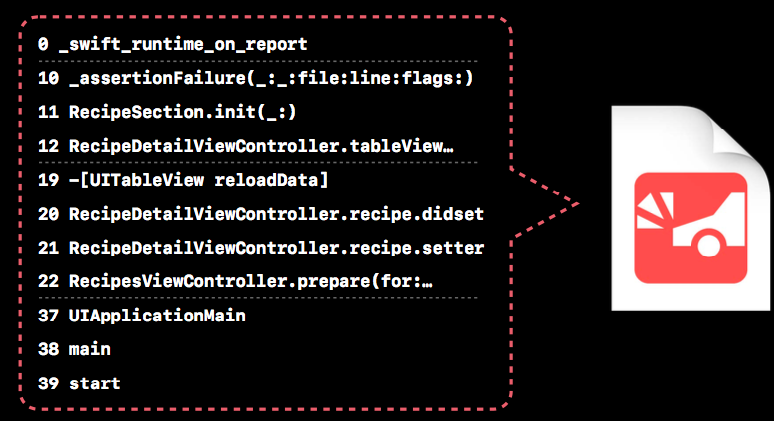

release版本的app发生crash时，log文件的调用栈只有地址信息

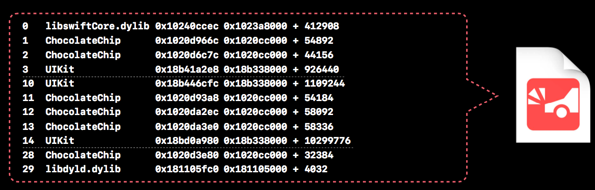

xcode符号化后的crash log

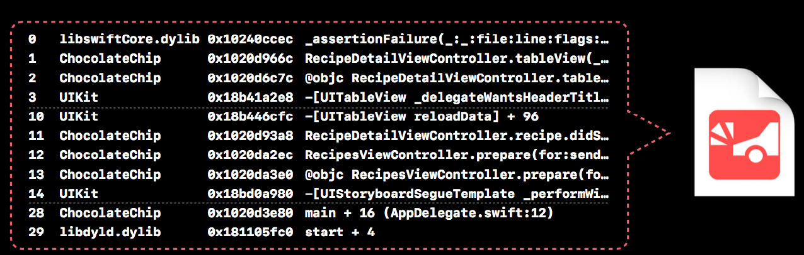

## Accessing crash logs
线上APP发生崩溃时，系统会把log文件上传到云端，然后可以通过xcode的organizer获取并分析crash，整体流程如图：

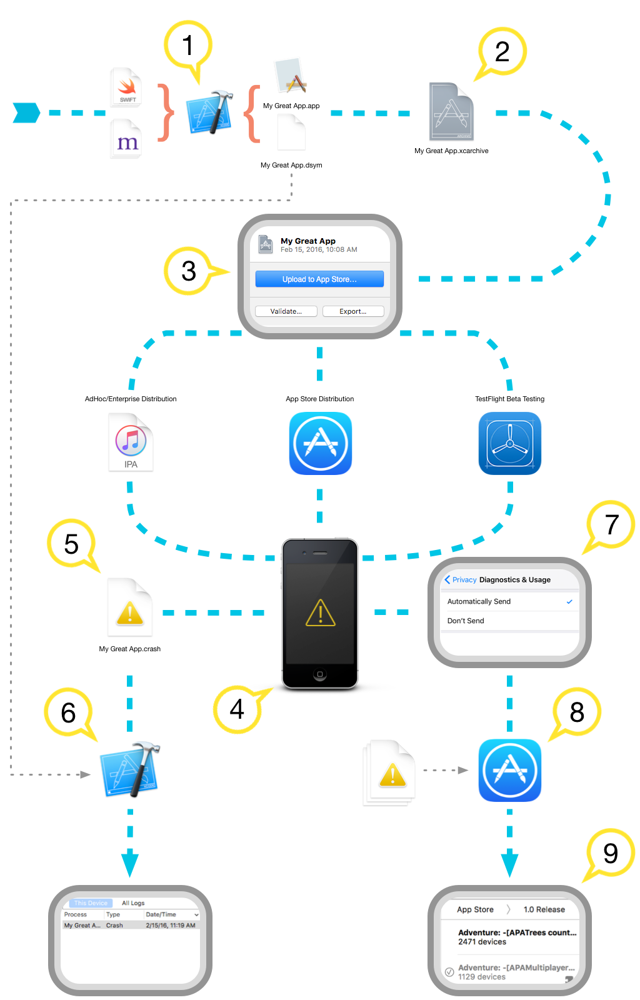

crash organizer中有TestFlight and App Store上App的crash数据。包括了最近crash的统计数据，受影响最大的devices信息，crash具体位置信息等

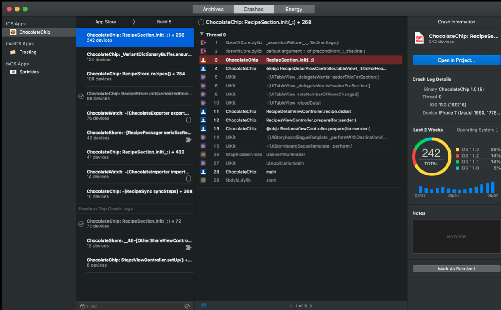

### 使用Crash Organizer
- App Store users opt in
- 使用apple id登录Xcode
- 上传带符号的App
- 打开Crash Organizer

### crash堆栈符号化最佳实践
- Upload app symbols for server-side symbolication
- Keep your app archive for local symbolication
- Download debug symbols for bitcode apps

## Analyzing crash logs

log文件中包含crash的的基本信息，crash原因，崩溃栈，寄存器等。

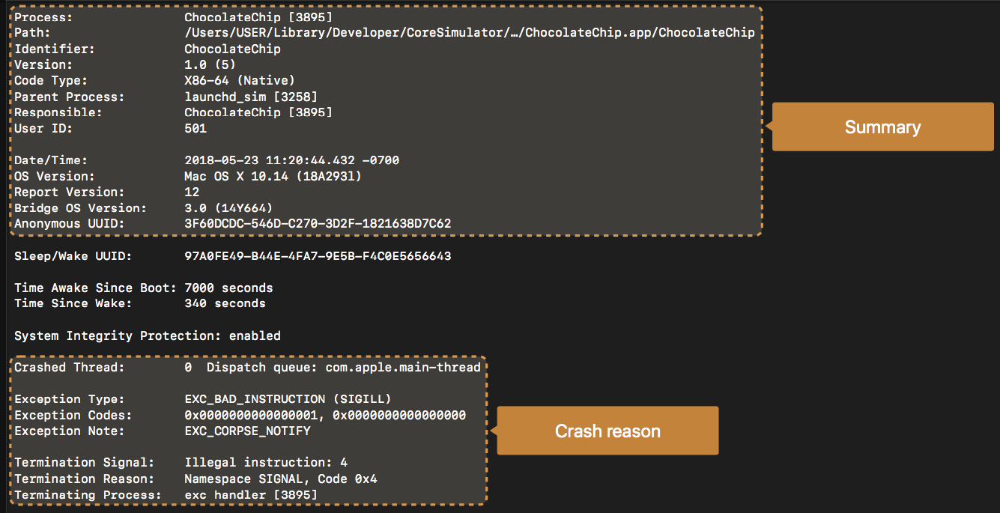

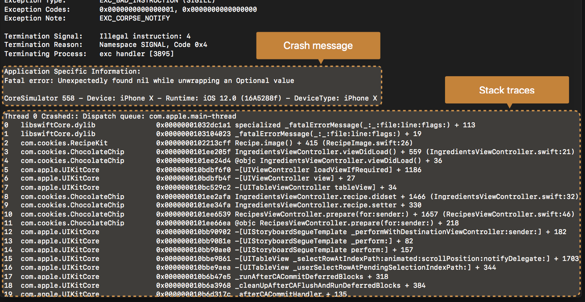

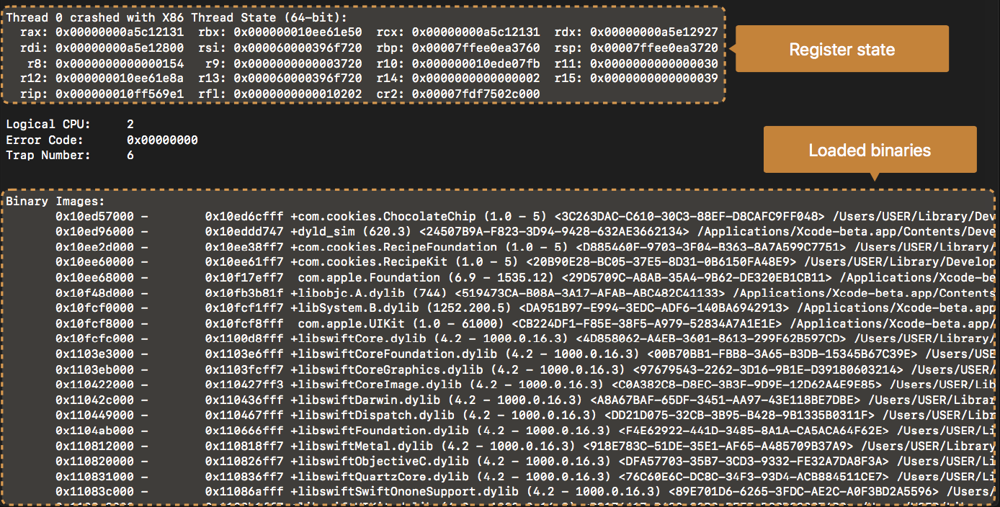

有了这些信息后，怎么分析crash原因呢？首先看一下Exception Type，通过这个可以知道crash的原因，比如这个例子中EXC_BAD_INSTRUCTION的意思是CPU可能尝试执行不合法的指令。也可以看一下Crash Thread的调用栈。

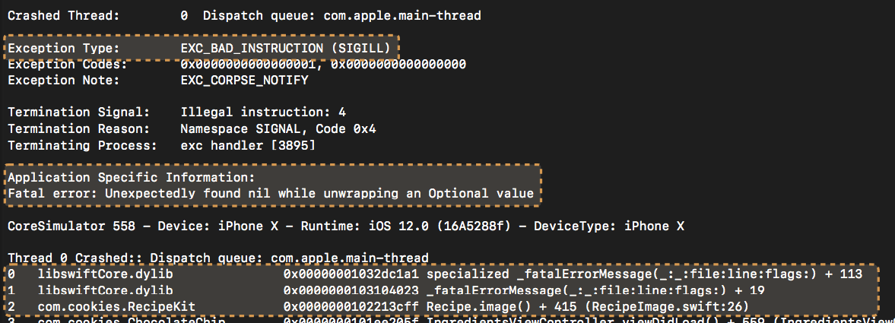

### Assertions and Preconditions 
Deliberately halt the process when an error has occurred Examples:
- Forced unwrap of an Optional that stores nil 
- Out-of-bounds Swift.Array access
- Swift arithmetic overflow
- Uncaught exception
- Custom assertion in your code

### 操作系统 Kill
- Watchdog 定时器超时
- 设备过热
- 内存耗尽
- 无效签名

一个具体的例子，下面这个crash信息可以看出，具体原因是看门狗定时器超时，一般是因为APP启动的时间过长或者响应系统事件事件超时导致；比如在主线程进行网络请求，主线程会一直卡住直到网络回调回来。

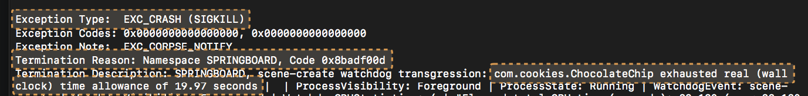

### Avoiding Launch Timeouts
- Frequent crash reason in app review
- Disabled in Simulator and in the debugger
- Test your app without the debugger 
- on a real device
- on older hardware

## Memory issues
### 内存问题分析
- over released
- buffer overflow
- used after free

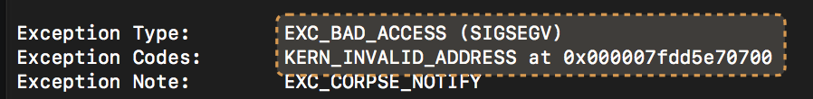

通过crash地址可以得到更多信息，7fdd5e70700这个地址在MALLOC_TINY的地址空间范围内，下图描述了objc_release的正常过程。

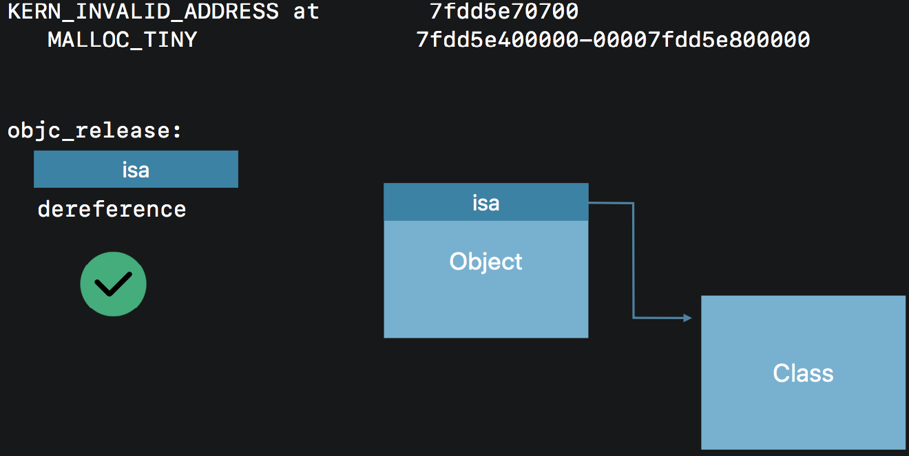

但如果该对象已经被free了，objc_release会导致崩溃。

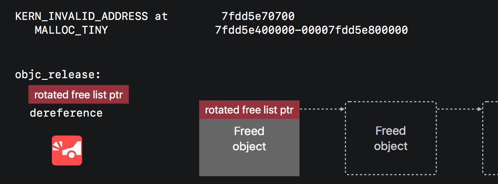

### 找到具体的对象
有没有办法知道具体是哪个object被多次release导致的crash呢？日志里面虽然有调用栈信息，但是都是编译器生成的函数，没有跟crash相关的具体信息。下面通过一个具体的例子说明如何找到LoginViewController中被多次release的对象。

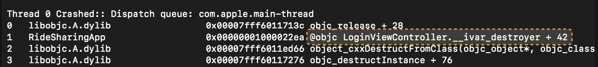

```swift
// LoginViewController.swift
class LoginViewController: UIViewController {
    var userName: String
    var database: DatabaseProxy
    var views: [UIView]
    ...
}
```

- 在命令行或者xcode打开lldb
- command script import lldb.macosx.crashlog
- 加载crash log文件

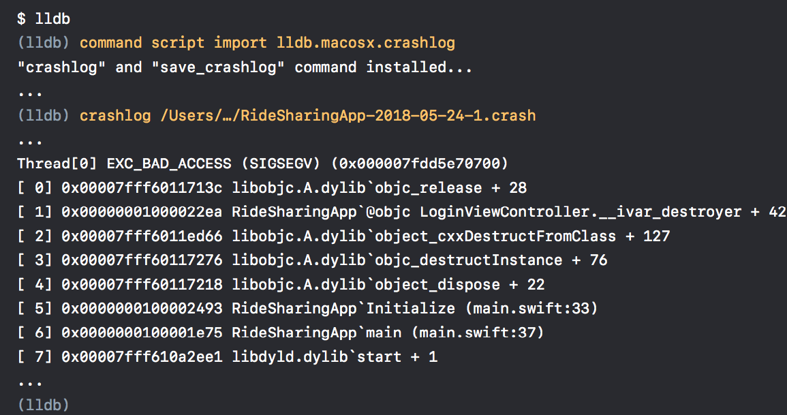

反汇编（disassemble），打印出crash位置的汇编代码，通过分析汇编代码可以知道哪里出了问题。

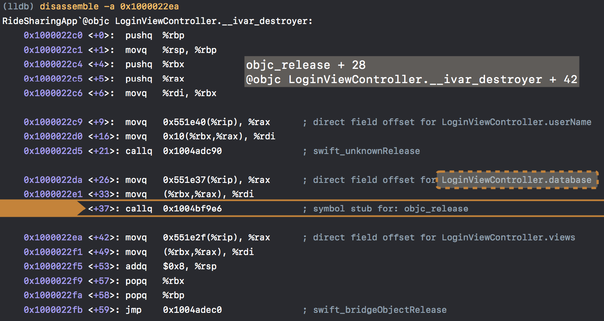

### 常见内存问题
- Crash in objc_msgSend or retain/release
- Unrecognized selector exception
- abort() inside malloc/free

### 小结
- 找到crash的原因
- 看一下crash线程的调用堆栈
- 通过crash地址和反汇编的方式找到更多的线索

## Multithread issues
- 多线程问题比较难重现和排查
- 多线程问题经常会导致内存问题
- 同一个问题崩溃位置通常不一致

### 使用Thread Sanitizer调试多线程问题
- Reliably reproduces multithreaded 
- bugs Works in Simulator

### 给每个线程加个名字，发生崩溃是容易定位问题

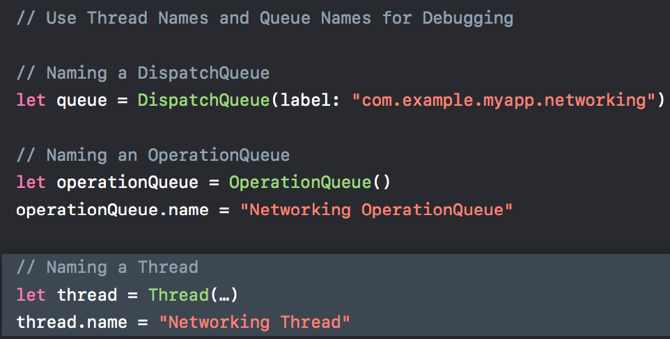

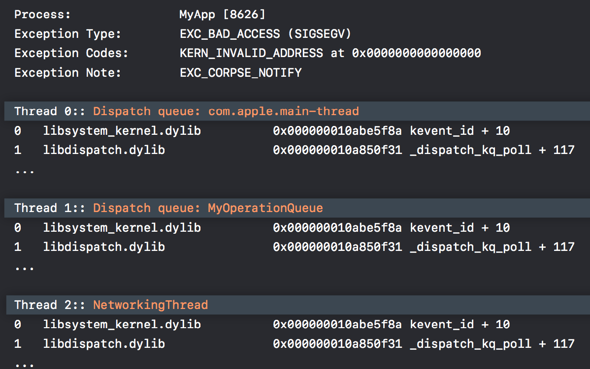

### 小结
- Use Organizer to access crash logs
- Analyze reproducible crashes
- Look for signs of memory corruption and threading issues 
- Use bug-finding tools to help reproduce
    - Address Sanitizer for memory corruption bugs 
    - Thread Sanitizer for multithreading problems

## 更多资料
1. [Understanding and Analyzing Application Crash Reports](https://developer.apple.com/library/archive/technotes/tn2151/_index.html#//apple_ref/doc/uid/DTS40008184-CH1-APPINFO)
2. [iOS crash文件解析及常见的Exception类型](https://www.jianshu.com/p/ce071aa3ffa8)