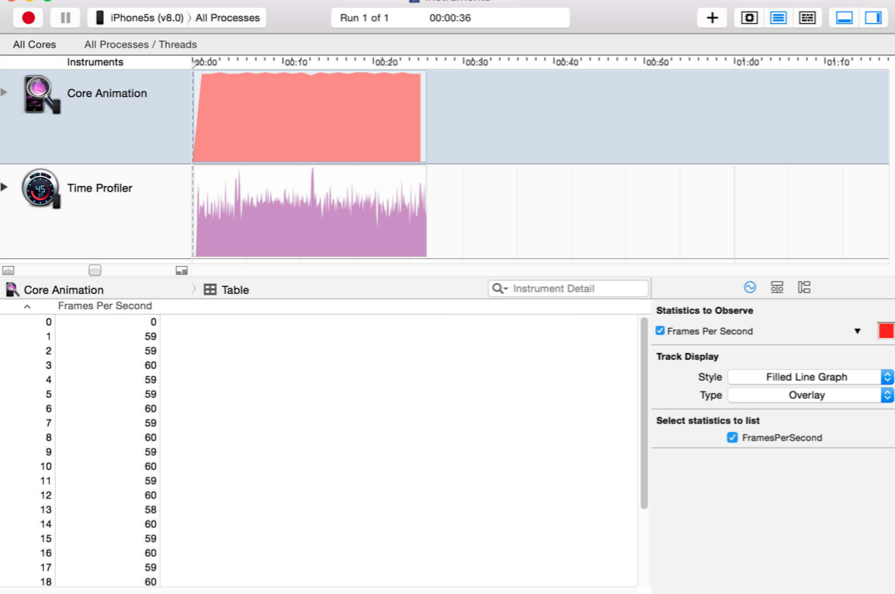
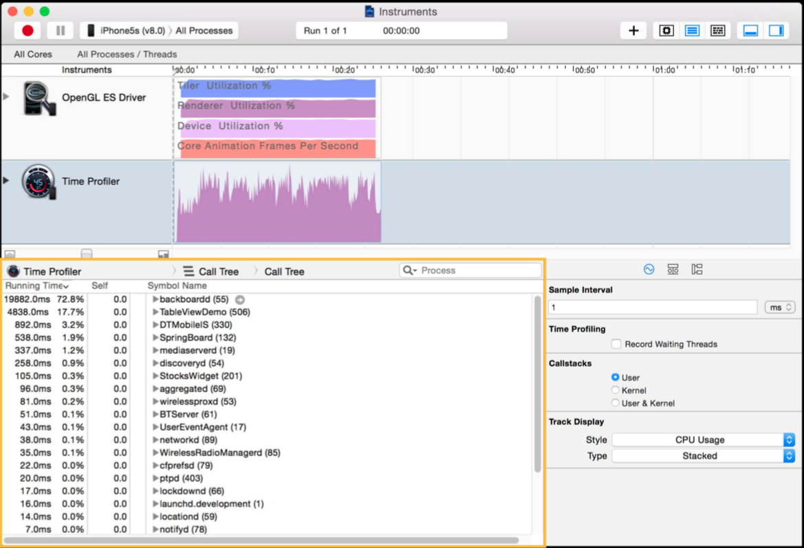
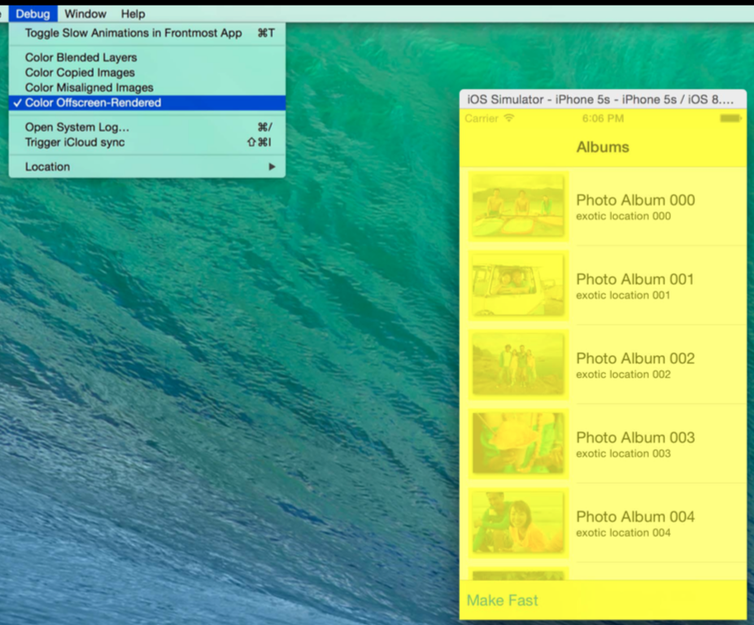
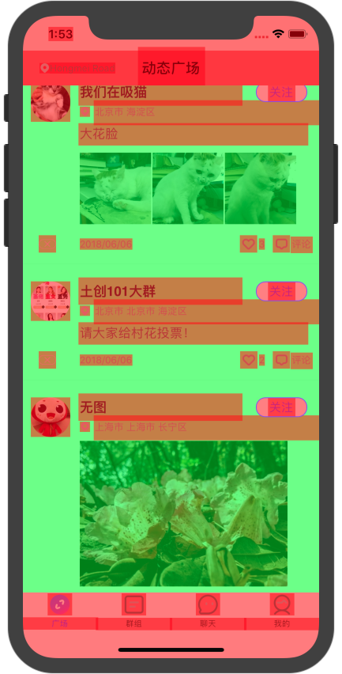
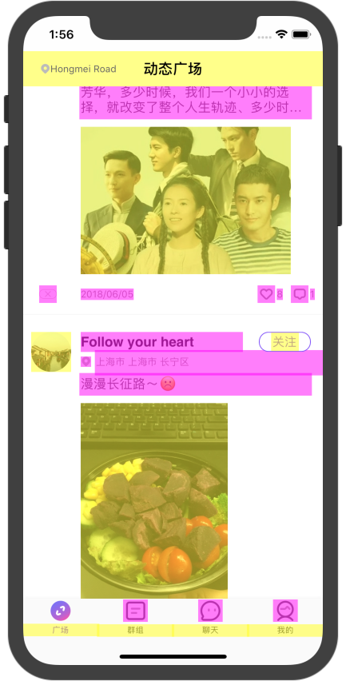

本文基于 [Advanced Graphics and Animations for iOS Apps](https://developer.apple.com/videos/play/wwdc2014/419/) 整理，介绍了Core Animation和iOS GPU渲染管线的基础知识，以及如何profiling，定位和解决 UI 性能问题。

> Creating a responsive UI requires an understanding of Core Animation and how mobile GPUs work. Learn about the iOS rendering pipeline in Core Animation, the new UIVisualEffectView and how it utilizes the GPU. Find out about the available tools for profiling UI performance. See how to identify and fix performance issues on a variety of devices.

<!-- more -->

主要大纲如下：
- Core Animation pipeline
- Rendering concepts
- UIBlurEffect && UIVibrancyEffect
- profiling tools
- case study

## Technology Framework

先看一下整体架构图

## Core Animation Pipeline

- 应用程序的动效是通过UIKit使用Core Animation实现的
- Render Server实现具体的动画逻辑
- 使用GPU加速渲染
- 为了保证动画流程，每秒钟至少需要有60帧，因此每一帧的渲染时间只有16毫秒

### 基本流程
- Application 接收并处理事件，编码后发送给Render Server (Commit Transaction)
- Render Server接收到请求后，首先解码，然后调研GPU的渲染接口
- GPU开始渲染具体的动效，理想情况下，在下一个VSync信号来之前，当前帧能渲染完，这样就不会丢帧导致卡顿
- 然后重复上述步骤

### Commit Transaction 四个步骤
- layout (view初始化以及排版)
    - layoutSubviews
    - addSubview
- display (view渲染)
    - drawRect
- prepare
    - image decoding
    - image conversion
- commit
    - layer 打包，打包发送到Render Server

### Animation 三个阶段
- Create animation and update view hierarchy
- commit transaction
- render each frame

## Rendering Concept
### Tile based rendering
- 屏幕划分成N*N像素的tiles
- 每个tile存放到SoC缓存中

### Render passes 

***

## 性能优化

### 思路
- 每秒钟60帧是优化目标
- CPU or GPU bound? 用的越少越省电
- Any unnecessary CPU rendering? 优先使用GPU，必要时也可以用CPU
- Too many offscreen passes? 越少越好
- Too much blending? 越少越好
- Any strange image formats or sizes? Avoid on-the-fly conversions or resizing
- Anything unexpected in hierarchy? Know the actual view hierarchy

### 工具
- Instruments
    - Core Animation instrument
    
    - OpenGL ES Driver instrument
    
- 模拟器
    - Color Debug options
    
- Xcode
    - view debugging

## case study

### 问题背景
- tableview
- 每个cell包括图片和文字
- 每个图片都包括阴影

### 性能测试及问题定位
- 先通过OpenGL Driver查看帧率
- 通过view debugging查看View Hierarchy
- 再通过Core Animation instrument查看offscreen-Rendered

***

## 扩展知识
视频中涉及很多知识点，有一些需要额外的扩展资料才能理解，查阅了一些资料，这里把关键点也列出来。

### Core Animation 性能分析选项
- Color Blended layers   标示混合的图层会为红色,不透明的图层为绿色，通常我们希望绿色的区域越多越好。

- Color copied images   标示那些被Core Animation拷贝的图片。这主要是因为该图片的色彩格式不能被GPU直接处理，需要在CPU这边做转换，假如在主线层做这个操作对性能会有一定的影响。

- Color misaligned images   被缩放的图片会被标记为黄色,像素不对齐则会标注为紫色。

- Color offscreen-rendered yellow   标示哪些layer需要做离屏渲染(offscreen-render)。

通常发生图形性能问题的时候，比如列表滑动不顺畅、动画卡顿等，大部分都是由于Offscreen Rendering(离屏渲染)或者blending导致的。

### Offscreen Rendering
Offscreen-render对性能到底有什么影响？通常大家说的离屏渲染指的是GPU这块(当然CPU这块也会有影响，也需要消耗一定的资源)，比如修改了layer的阴影或者圆角，GPU需要做额外的渲染操作。通常GPU在做渲染的时候是很快的，但是涉及到offscreen-render的时候情况就可能有些不同，因为需要额外开辟一个新的缓冲区进行渲染，然后绘制到当前屏幕的过程需要做onscreen跟offscreen上下文之间的切换，这个过程的消耗会比较昂贵，涉及到OpenGL的pipeline跟barrier，而且offscreen-render在每一帧都会涉及到，因此处理不当肯定会对性能产生一定的影响，所以可以的话尽量减少offscreen-render的图层。产生离屏渲染的操作有：
- 阴影（UIView.layer.shadowOffset/shadowRadius/…）
- 圆角（当 UIView.layer.cornerRadius 和 UIView.layer.maskToBounds 一起使用时）
- 图层蒙板
- 开启光栅化（shouldRasterize = true）

### 列表滚动卡顿的主要原因

- Cell创建
    - Offscreen 创建 cell 时间过长: 简化 drawRect
    - drawRect 过于复杂: 缓存并复用
    - view层级过于复杂: 扁平化view层级

- Cell滚动
    - offscreen gets called in each cell: Use hybrid mode from above and cache the images.
    - 过多 blending 操作: Make views opaque and rasterize the layers.

## 更多资料
1. [iOS app性能优化的那些事(二)](https://www.jianshu.com/p/2a01e5e2141f)
2. [Help! My tables don’t scroll smoothly!](http://iosinjordan.tumblr.com/post/56778173518/help-my-tables-dont-scroll-smoothly)
3. [iOS 保持界面流畅的技巧](https://blog.ibireme.com/2015/11/12/smooth_user_interfaces_for_ios/)
4. [iOS渲染机制与性能优化](https://blog.csdn.net/u011342466/article/details/50918035)