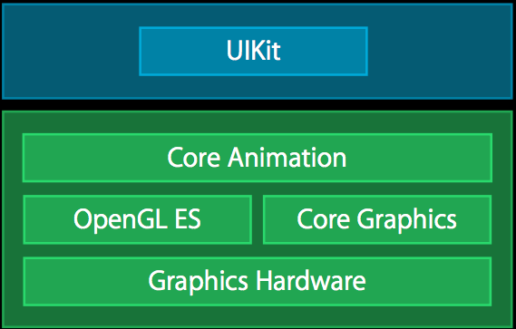
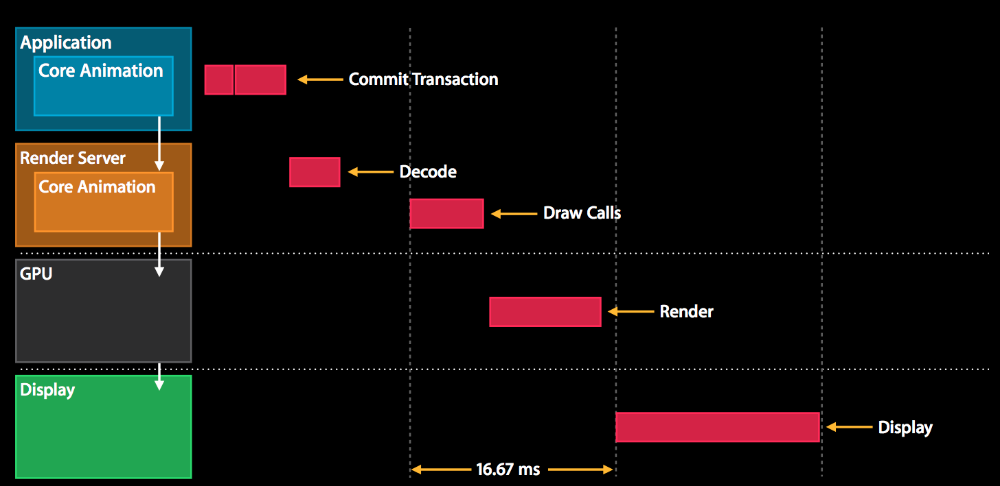
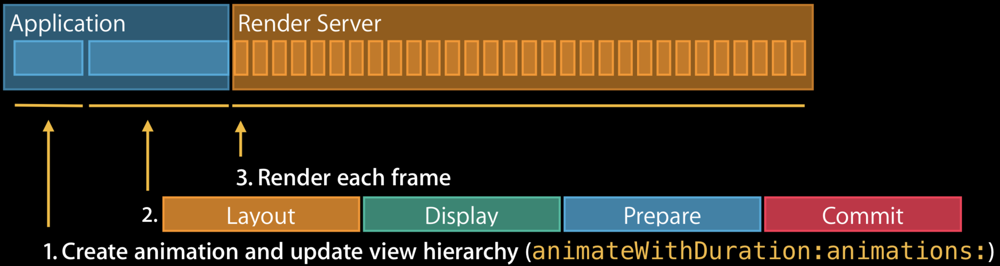
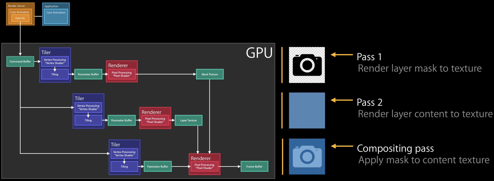

本文基于 [Advanced Graphics and Animations for iOS Apps](https://developer.apple.com/videos/play/wwdc2014/419/) 整理，介绍了Core Animation和iOS GPU渲染管线的基础知识，以及如何profiling，定位和解决 UI 性能问题。

> Creating a responsive UI requires an understanding of Core Animation and how mobile GPUs work. Learn about the iOS rendering pipeline in Core Animation, the new UIVisualEffectView and how it utilizes the GPU. Find out about the available tools for profiling UI performance. See how to identify and fix performance issues on a variety of devices.

<!-- more -->

主要大纲如下：
- Core Animation pipeline
- Rendering concepts
- UIBlurEffect
- UIVibrancyEffect
- profiling tools
- case study

## Technology Framework

先看一下整体架构图

## Core Animation Pipeline

- 应用程序的动效是通过UIKit使用Core Animation实现的
- Render Server实现具体的动画逻辑
- 使用GPU加速渲染
- 为了保证动画流程，每秒钟至少需要有60帧，因此每一帧的渲染时间只有16毫秒

### 基本流程
- Application 接收并处理事件，编码后发送给Render Server (Commit Transaction)
- Render Server接收到请求后，首先解码，然后调研GPU的渲染接口
- GPU开始渲染具体的动效，理想情况下，在下一个VSync信号来之前，当前帧能渲染完，这样就不会丢帧导致卡顿
- 然后重复上述步骤

### Commit Transaction 四个步骤
- layout (view初始化以及排版)
    - layoutSubviews
    - addSubview
- display (view渲染)
    - drawRect
- prepare
    - image decoding
    - image conversion
- commit
    - layer 打包，打包发送到Render Server

### Animation 三个阶段
- Create animation and update view hierarchy
- commit transaction
- render each frame

## Rendering Concept
### Tile based rendering
- 屏幕划分成N*N像素的tiles
- 每个tile存放到SoC缓存中

### Render passes 
- Application  把动画send to render server
- 
- GPU Command Buffer

### Example masking